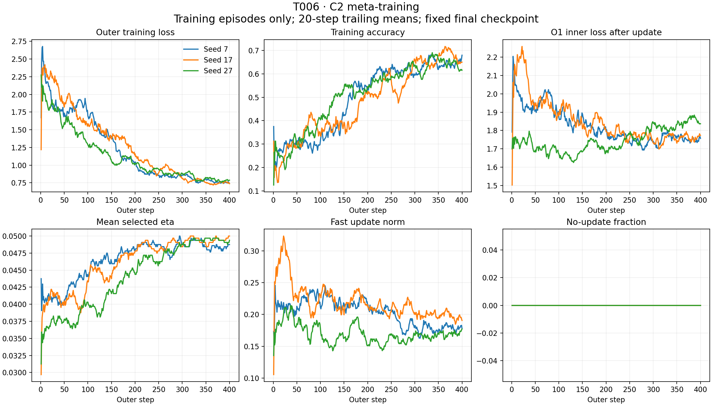

# T006 controlled C2 meta-training

Stop/reframe: the required fast-path and control gains do not both hold.

Rules 1, 2, 4 and 5 pass; Rule 3 fails. Fast adaptation improves its own new W0, but absolute hard accuracy is 34.625%, ten percentage points below B2. This is a control-competitiveness failure, not loss of all fast-path value or a gradient-engineering failure.

Engineering status VERIFIED; research acceptance pending. No detector or T007.

Tested code 65299db5f1127407f856872b732f2b2b7051383e; preregistration f9f4137. Run 20260912-065105-tovd-t006-a6000, physical A6000 GPU 1. Three seeds, 400 Adam(.001) steps x4 balanced training episodes, final checkpoint only. Only the method changes from the original T002 config; C2 sequence and Armijo constant are unchanged.

Task scoring and task gradients are offline oracle diagnostics. Training labels enter outer CE only; inner adaptation and eta selection remain label-free. Selected eta is held constant when differentiating the accepted update. Stable-region finite differences and eta switches are reported separately.

Mean ± sample SD across seeds; accuracy in percent. All historical controls were re-evaluated on the same held-out streams.

## Own W0 versus adapted

| Regime | W0 accuracy % | Adapted accuracy % | W0 NLL | Adapted NLL | Delta NLL | W0 margin | Adapted margin |
| --- | --- | --- | --- | --- | --- | --- | --- |
| easy | 63.333333 ± 12.958065 | 73.708333 ± 7.830562 | 0.874866 ± 0.298847 | 0.664928 ± 0.175939 | -0.209938 ± 0.377752 | 0.090949 ± 0.046833 | 0.106604 ± 0.031842 |
| hard | 29.916667 ± 1.161447 | 34.625000 ± 2.490607 | 1.469848 ± 0.054261 | 1.358451 ± 0.015320 | -0.111397 ± 0.039349 | -0.049783 ± 0.006210 | -0.031288 ± 0.001254 |

## Historical matched controls

| Method | Regime | Accuracy % | NLL | Margin |
| --- | --- | --- | --- | --- |
| T002 B0 (re-evaluated) | easy | 79.416667 ± 8.419038 | 0.464635 ± 0.145216 | 0.255355 ± 0.043024 |
| T002 B0 (re-evaluated) | hard | 42.333333 ± 7.843522 | 1.260052 ± 0.077047 | -0.019148 ± 0.012846 |
| T002 B1 (re-evaluated) | easy | 72.041667 ± 10.279176 | 0.647268 ± 0.127711 | 0.135553 ± 0.013297 |
| T002 B1 (re-evaluated) | hard | 37.750000 ± 3.191786 | 1.320541 ± 0.020695 | -0.012434 ± 0.003131 |
| T002 B2 (re-evaluated) | easy | 72.916667 ± 10.492805 | 0.768581 ± 0.279928 | 0.206045 ± 0.026284 |
| T002 B2 (re-evaluated) | hard | 44.625000 ± 5.233605 | 1.262266 ± 0.090281 | -0.019920 ± 0.013243 |
| T002 P (re-evaluated) | easy | 74.875000 ± 15.650479 | 0.586114 ± 0.268593 | 0.162208 ± 0.042888 |
| T002 P (re-evaluated) | hard | 39.416667 ± 1.301041 | 1.302649 ± 0.016290 | -0.022154 ± 0.004724 |
| T005 frozen C2 (stored reference) | easy | 86.708333 ± 5.107184 | 0.344488 ± 0.096946 | 0.213149 ± 0.031026 |
| T005 frozen C2 (stored reference) | hard | 46.250000 ± 4.222336 | 1.235361 ± 0.025688 | -0.012703 ± 0.003650 |

Historical controls are separately trained T002 checkpoints, not new T006 runs. T005 C2 starts from original P W0; it is not the same initialization as newly meta-trained C2.

## Inner/update and task alignment

| Regime | Inner before | Inner after | Raw O1 gradient norm | Actual update norm | Task cosine | Task dot |
| --- | --- | --- | --- | --- | --- | --- |
| easy | 2.479824 ± 0.622313 | 1.937962 ± 0.268809 | 7.062260 ± 2.073256 | 0.273330 ± 0.122612 | 0.499946 ± 0.178931 | 32.186745 ± 20.409359 |
| hard | 1.671315 ± 0.027236 | 1.543777 ± 0.012009 | 1.609137 ± 0.120073 | 0.080457 ± 0.006004 | 0.320918 ± 0.081908 | 2.645892 ± 0.889317 |

## Task improvement fractions and selector

| Regime | Episodes improve % | Queries improve % | Mean eta | Mean trials | Eta-zero fraction | Armijo satisfied fraction |
| --- | --- | --- | --- | --- | --- | --- |
| easy | 64.000000 ± 20.663978 | 59.000000 ± 10.505207 | 0.038583 ± 0.009475 | 1.460000 ± 0.383536 | 0.000000 ± 0.000000 | 1.000000 ± 0.000000 |
| hard | 71.333333 ± 6.506407 | 63.416667 ± 3.375772 | 0.050000 ± 0.000000 | 1.000000 ± 0.000000 | 0.000000 ± 0.000000 | 1.000000 ± 0.000000 |

## Per-seed paired outcomes

| Regime | Seed | W0 accuracy % | Adapted accuracy % | Delta accuracy pp | W0 NLL | Adapted NLL | Delta NLL | Task cosine |
| --- | --- | --- | --- | --- | --- | --- | --- | --- |
| easy | 7 | 74.500000 | 77.125000 | 2.625000 | 0.621788 | 0.561783 | -0.060004 | 0.340801 |
| easy | 17 | 49.125000 | 79.250000 | 30.125000 | 1.204564 | 0.564924 | -0.639639 | 0.693627 |
| easy | 27 | 66.375000 | 64.750000 | -1.625000 | 0.798248 | 0.868078 | 0.069829 | 0.465411 |
| hard | 7 | 31.250000 | 36.125000 | 4.875000 | 1.468081 | 1.354517 | -0.113564 | 0.331303 |
| hard | 17 | 29.375000 | 36.000000 | 6.625000 | 1.524971 | 1.375353 | -0.149617 | 0.397138 |
| hard | 27 | 29.125000 | 31.750000 | 2.625000 | 1.416491 | 1.345481 | -0.071010 | 0.234313 |

## Exact preregistered rule decisions

```json
{
  "rule1_validity": {
    "finished_seeds": [
      7,
      17,
      27
    ],
    "steps_per_seed": {
      "7": 400,
      "17": 400,
      "27": 400
    },
    "training_nonfinite_steps": 0,
    "training_armijo_violations": 0,
    "test_armijo_violations": 0,
    "test_nonfinite_elements": 0,
    "control_max_metric_error": 0.0,
    "control_stream_mismatches": 0,
    "normal_output_max_error": 0.0,
    "normal_state_max_error": 0.0,
    "W0_only_metric_max_error": 0.0,
    "training_runner_eval_max_error": 0.0,
    "initial_tensor_max_error": 0.0,
    "initial_meta_gradient_requirement_passes": true,
    "passes": true
  },
  "rule2_fast_value": {
    "hard_nll_delta": -0.11139690895875295,
    "hard_accuracy_delta_pp": 4.708333333333334,
    "nll_improving_seeds": 3,
    "passes": true
  },
  "rule3_control_value": {
    "accuracy_branch": {
      "control": "B2",
      "accuracy_gain_pp": -9.999999999999998,
      "nll_gain": -0.09618439356486008,
      "passes": false
    },
    "nll_branch": {
      "control": "B0",
      "accuracy_gain_pp": -7.708333333333334,
      "nll_gain": -0.09839880277713142,
      "passes": false
    },
    "passes": false
  },
  "rule4_easy_safety": {
    "easy_nll_delta": -0.20993804924810927,
    "easy_accuracy_delta_pp": 10.375,
    "seed_robustness_flags": {},
    "passes": true
  },
  "rule5_mechanism": {
    "hard_cosine_gain_vs_original_O0": 0.3320747391809709,
    "reset_state_max": 0.0,
    "reset_output_max": 0.0,
    "vocabulary_changes_state_all_seeds": true,
    "passes": true
  },
  "recommendation": "Stop/reframe: the required fast-path and control gains do not both hold."
}
```

Rule 3 uses the highest-accuracy control for its accuracy branch and the lowest-NLL control for its NLL branch, with non-worsening of the other metric against the same comparator. This interpretation was fixed at f9f4137 before T006 outcomes. All control results are shown above.

## Training evidence



Plot shows trailing 20-step means for readability, not training or checkpoint selection. All 1,200 raw step records, including each batch's four selected etas and trial counts, are in training_curves.csv and the original seed training.json files.

| Seed | Steps | Last outer loss | Last batch accuracy % | W0 drift | Training seconds | Eta counts |
| --- | --- | --- | --- | --- | --- | --- |
| 7 | 400 | 0.633483 | 84.375 | 3.646651 | 51.437 | {'0.05': 1398, '0.025': 179, '0.0125': 23} |
| 17 | 400 | 0.763902 | 50.000 | 3.620070 | 52.510 | {'0.00625': 1, '0.05': 1390, '0.0125': 53, '0.025': 156} |
| 27 | 400 | 0.777379 | 59.375 | 3.708563 | 52.609 | {'0.0125': 82, '0.05': 1272, '0.025': 246} |

## Initial/final selector and meta-gradient probes

Fixed first 20 training episodes per seed, independent of held-out outcomes. Float64 copies; W0 output.weight directions and perturbation magnitudes were preregistered. Epsilon1e-5 is the numerical agreement check. Larger probes characterize selector regions and finite-step truncation, not a global-smoothness guarantee.

| Phase | Epsilon | Probes | Switches | Switch fraction | Stable max absolute FD error | Stable tolerance disagreements |
| --- | --- | --- | --- | --- | --- | --- |
| initial | 1e-05 | 60 | 0 | 0.000000 | 7.55856766e-11 | 0 |
| initial | 0.001 | 60 | 0 | 0.000000 | 4.67880081e-08 | 0 |
| initial | 0.01 | 60 | 0 | 0.000000 | 4.67877178e-06 | 1 |
| initial | 0.1 | 60 | 1 | 0.016667 | 0.00046770811 | 33 |
| final | 1e-05 | 60 | 0 | 0.000000 | 3.08320175e-11 | 0 |
| final | 0.001 | 60 | 0 | 0.000000 | 3.50979118e-09 | 0 |
| final | 0.01 | 60 | 0 | 0.000000 | 3.50977035e-07 | 0 |
| final | 0.1 | 60 | 0 | 0.000000 | 3.50916571e-05 | 44 |

Switched probes have stable_region_agreement=null and are not graded as smooth derivatives. Full gradients, base/plus/minus etas, analytic/numerical derivatives, and seed summaries are in meta_gradient_{initial,final}.json.

## Held-out chosen eta counts

| Seed/regime | Eta counts |
| --- | --- |
| seed7_easy | {'0.05': 48, '0.025': 52} |
| seed7_hard | {'0.05': 100} |
| seed17_easy | {'0.025': 77, '0.05': 21, '0.0125': 2} |
| seed17_hard | {'0.05': 100} |
| seed27_easy | {'0.05': 95, '0.025': 5} |
| seed27_hard | {'0.05': 100} |

## Matched normal-forward latency

Same newly trained tensors for C2, original P objective and O1_fixed; three warmed complete passes per seed/regime with GPU synchronization. Oracle scoring excluded. Prototype CPU/GPU synchronization overhead and shared-host activity limit interpretation of small differences.

| Seed | Regime | C2 ms | P same W0 ms | O1 fixed same W0 ms | C2/P | C2/O1 fixed |
| --- | --- | --- | --- | --- | --- | --- |
| 7 | easy | 11.16691 | 8.61307 | 10.89671 | 1.29651 | 1.02480 |
| 7 | hard | 11.04502 | 8.65129 | 10.54489 | 1.27669 | 1.04743 |
| 17 | easy | 11.27284 | 8.58781 | 10.51690 | 1.31266 | 1.07188 |
| 17 | hard | 11.38801 | 8.62444 | 10.53151 | 1.32044 | 1.08133 |
| 27 | easy | 11.10953 | 8.64795 | 10.53560 | 1.28464 | 1.05448 |
| 27 | hard | 11.04187 | 8.65252 | 10.54903 | 1.27615 | 1.04672 |

## Vocabulary, reset and provenance

| Seed | Easy/hard state delta | Unrelated state delta | Unrelated output delta | Reset state max | Reset output max |
| --- | --- | --- | --- | --- | --- |
| 7 | 0.153588 | 0.181230 | 0.526352 | 0 | 0 |
| 17 | 0.284037 | 0.197800 | 0.585044 | 0 | 0 |
| 27 | 0.435571 | 0.357993 | 1.000209 | 0 | 0 |

New held-out diagnoses: 600, per-query changes: 4800. Twelve source checkpoints re-evaluated; full hashes, stream equality, unchanged initial tensors and run manifest are in verification.json. Raw diagnostic scores match normal evaluation and the explicit disabled-update path as recorded in Rule 1.

## Interpretation

The hard fast-path gain survives meta-training: all three seeds improve NLL and accuracy over their own W0. The learned W0 itself has low held-out accuracy (29.91667%), so a +4.70833pp adaptive gain reaches only 34.625%. The new adapted model is worse than B0, B1, B2, original P and the historical frozen-C2 result on both hard mean accuracy and NLL. The experiment does not isolate the cause of weaker absolute generalization.

Hard task alignment is retained and strengthened relative to original P, with cosine .320918 versus -.011157. All hard held-out episodes now accept eta=.05 on the first trial. This is observed controller behavior; it does not prove that the selector is globally smooth or that ignoring line search would be equivalent throughout training.

Easy aggregate safety passes with no preregistered major seed flag. Seed 27 nevertheless has mild own-W0 harm (+.069829 NLL, -1.625pp), retained in the per-seed table. No claim of uniform per-episode or per-seed improvement is warranted.

Recommend stop/reframe the current meta-training formulation before detector integration. Do not reinterpret Rule 3 as optional, tune the fixed schedule after these outcomes, or erase the positive Rule 2 mechanism evidence. Any further diagnosis requires Research Lead review.

## Artifacts

Complete checkpoints, training logs, control records, probe receipts and held-out raw records: research_log/remote_runs/20260912-065105-tovd-t006-a6000/. results.json / aggregate.csv retain all distributions; rules.json records the fixed decisions. No source checkpoint or unsuccessful outcome is removed.
