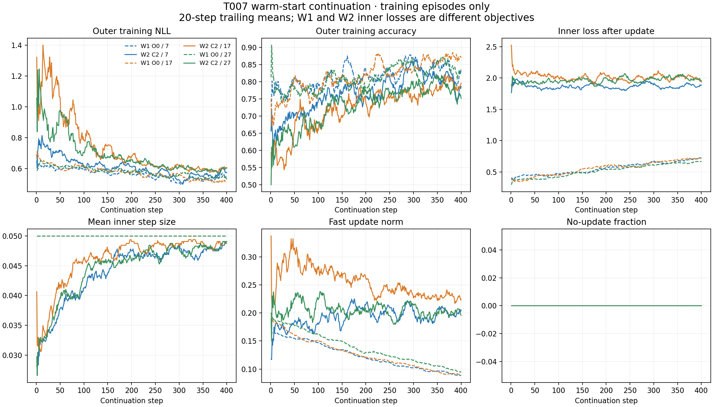
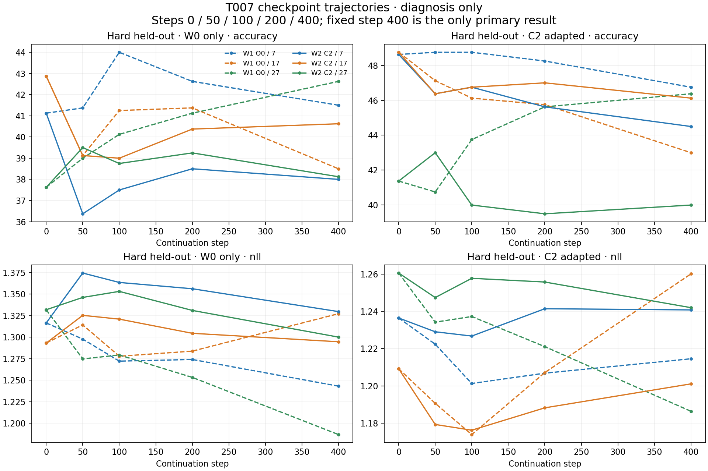

# T007 warm-start origin audit

Run `20260912-083417-tovd-t007-a6000`; tested code `e88ad88112f6486f8c7dc8458594e095528ba9f1`; preregistration `deeacd4`.

W1=P_O0_resume, W2=P_C2_warm. Both start from the same final T002 P tensors, reset Adam moments,
and continue .001 Adam for400x4 episodes, indices1600..3199. Final400 is primary; all intermediate
checkpoints are diagnostic only. O1+C2 is label-free; oracle task gradients stay offline.

## Fixed decision rules

| Rule | Pass | Evidence |
| --- | --- | --- |
| rule1_validity | PASS | See rules.json for every threshold and scalar. |
| rule2_fast_value | PASS | See rules.json for every threshold and scalar. |
| rule3_preservation | FAIL | See rules.json for every threshold and scalar. |
| rule4_objective_effect | FAIL | See rules.json for every threshold and scalar. |
| rule5_control_value | PASS | See rules.json for every threshold and scalar. |
| rule6_easy_mechanism | FAIL | See rules.json for every threshold and scalar. |

Warm-start C2 does not meet all predefined viability criteria; do not proceed to detector integration. W2 is worse than matched W1+C2 in both hard accuracy and NLL, evidence of objective-specific continuation degradation.

W2 hard accuracy is 43.5417%; its NLL control gate passes against B0, but its accuracy remains below B2. This is not a repeat of the T006 Rule3 control failure.
W1+C2 retains hard performance (45.3750%, NLL 1.220324), yet harms easy accuracy by 6.7917pp and NLL by 0.262312 on average.
W2 easy seed27 loses7.625pp with NLL+.114365 despite the positive aggregate. W2 beats W1 on hard seed17, but loses on seeds7/27: the mean objective-specific effect is not uniform across seeds.
Retain T005 as a fixed-checkpoint mechanism reference, not evidence of safety for arbitrary continued checkpoints. These results do not support adding more C2-training tricks or integrating a detector under this task.

## Final held-out task metrics

Mean ± sample SD across seeds; accuracy in percent. W0/adapted are the same checkpoint.

| Model | Regime | Path | Accuracy (%) | NLL | Margin |
| --- | --- | --- | --- | --- | --- |
| T005_frozen_C2 | easy | W0 | 77.583333 ± 9.995572 | 0.555919 ± 0.208895 | 0.207188 ± 0.013715 |
| T005_frozen_C2 | easy | C2 | 86.708333 ± 5.107184 | 0.344488 ± 0.096946 | 0.213149 ± 0.031026 |
| T005_frozen_C2 | hard | W0 | 40.541667 ± 2.673169 | 1.313905 ± 0.019503 | -0.026497 ± 0.003317 |
| T005_frozen_C2 | hard | C2 | 46.250000 ± 4.222336 | 1.235361 ± 0.025688 | -0.012703 ± 0.003650 |
| T006_random_C2 | easy | W0 | 63.333333 ± 12.958065 | 0.874866 ± 0.298847 | 0.090949 ± 0.046833 |
| T006_random_C2 | easy | C2 | 73.708333 ± 7.830562 | 0.664928 ± 0.175939 | 0.106604 ± 0.031842 |
| T006_random_C2 | hard | W0 | 29.916667 ± 1.161447 | 1.469848 ± 0.054261 | -0.049783 ± 0.006210 |
| T006_random_C2 | hard | C2 | 34.625000 ± 2.490607 | 1.358451 ± 0.015320 | -0.031288 ± 0.001254 |
| P_O0_resume | easy | W0 | 80.958333 ± 10.932558 | 0.404780 ± 0.146824 | 0.267502 ± 0.040540 |
| P_O0_resume | easy | C2 | 74.166667 ± 5.537279 | 0.667092 ± 0.203131 | 0.188768 ± 0.070515 |
| P_O0_resume | hard | W0 | 40.875000 ± 2.132340 | 1.252460 ± 0.070657 | -0.017203 ± 0.011291 |
| P_O0_resume | hard | C2 | 45.375000 ± 2.065339 | 1.220324 ± 0.037163 | -0.011457 ± 0.007601 |
| P_C2_warm | easy | W0 | 77.166667 ± 13.363508 | 0.549442 ± 0.268388 | 0.212514 ± 0.063214 |
| P_C2_warm | easy | C2 | 88.875000 ± 3.642201 | 0.305853 ± 0.064424 | 0.241524 ± 0.028656 |
| P_C2_warm | hard | W0 | 38.916667 ± 1.480780 | 1.308197 ± 0.018865 | -0.025225 ± 0.003527 |
| P_C2_warm | hard | C2 | 43.541667 ± 3.172965 | 1.227928 ± 0.023253 | -0.011460 ± 0.003051 |
| T002 B0 | easy | original | 79.416667 ± 8.419038 | 0.464635 ± 0.145216 | 0.255355 ± 0.043024 |
| T002 B0 | hard | original | 42.333333 ± 7.843522 | 1.260052 ± 0.077047 | -0.019148 ± 0.012846 |
| T002 B1 | easy | original | 72.041667 ± 10.279176 | 0.647268 ± 0.127711 | 0.135553 ± 0.013297 |
| T002 B1 | hard | original | 37.750000 ± 3.191786 | 1.320541 ± 0.020695 | -0.012434 ± 0.003131 |
| T002 B2 | easy | original | 72.916667 ± 10.492805 | 0.768581 ± 0.279928 | 0.206045 ± 0.026284 |
| T002 B2 | hard | original | 44.625000 ± 5.233605 | 1.262266 ± 0.090281 | -0.019920 ± 0.013243 |
| T002 P | easy | original | 74.875000 ± 15.650479 | 0.586114 ± 0.268593 | 0.162208 ± 0.042888 |
| T002 P | hard | original | 39.416667 ± 1.301041 | 1.302649 ± 0.016290 | -0.022154 ± 0.004724 |

## Per-seed fast value

Delta=adapted minus own W0. Positive NLL delta is harm.

| Branch | Seed | Regime | W0 accuracy | C2 accuracy | Delta pp | W0 NLL | C2 NLL | Delta NLL |
| --- | --- | --- | --- | --- | --- | --- | --- | --- |
| P_O0_resume | 7 | easy | 86.375000 | 75.375000 | -11.000000 | 0.335840 | 0.701003 | 0.365164 |
| P_O0_resume | 17 | easy | 68.375000 | 68.125000 | -0.250000 | 0.573387 | 0.851133 | 0.277746 |
| P_O0_resume | 27 | easy | 88.125000 | 79.000000 | -9.125000 | 0.305114 | 0.449139 | 0.144025 |
| P_O0_resume | 7 | hard | 41.500000 | 46.750000 | 5.250000 | 1.243157 | 1.214545 | -0.028612 |
| P_O0_resume | 17 | hard | 38.500000 | 43.000000 | 4.500000 | 1.327307 | 1.260039 | -0.067268 |
| P_O0_resume | 27 | hard | 42.625000 | 46.375000 | 3.750000 | 1.186915 | 1.186390 | -0.000526 |
| P_C2_warm | 7 | easy | 68.000000 | 89.750000 | 21.750000 | 0.741902 | 0.326773 | -0.415129 |
| P_C2_warm | 17 | easy | 71.000000 | 92.000000 | 21.000000 | 0.663572 | 0.233569 | -0.430004 |
| P_C2_warm | 27 | easy | 92.500000 | 84.875000 | -7.625000 | 0.242851 | 0.357217 | 0.114365 |
| P_C2_warm | 7 | hard | 38.000000 | 44.500000 | 6.500000 | 1.329756 | 1.240744 | -0.089012 |
| P_C2_warm | 17 | hard | 40.625000 | 46.125000 | 5.500000 | 1.294714 | 1.201086 | -0.093628 |
| P_C2_warm | 27 | hard | 38.125000 | 40.000000 | 1.875000 | 1.300122 | 1.241953 | -0.058168 |

## Final train-versus-held-out metrics

Training diagnostics use the final100 easy and100 hard continuation episodes, all seen by step400.
The training-objective path uses O0 for W1 and C2 for W2; both other paths use common W0/C2 evaluation.

| Branch | Seed | Split | Regime | Path | Accuracy (%) | NLL | Margin |
| --- | --- | --- | --- | --- | --- | --- | --- |
| P_O0_resume | 7 | train_seen_at_final | easy | before | 100.000000 | 0.013602 | 0.610079 |
| P_O0_resume | 7 | train_seen_at_final | easy | after | 85.625000 | 0.428859 | 0.400232 |
| P_O0_resume | 7 | train_seen_at_final | easy | training_objective | 100.000000 | 0.014540 | 0.582933 |
| P_O0_resume | 7 | train_seen_at_final | hard | before | 71.375000 | 0.955522 | 0.033635 |
| P_O0_resume | 7 | train_seen_at_final | hard | after | 62.375000 | 1.013569 | 0.020964 |
| P_O0_resume | 7 | train_seen_at_final | hard | training_objective | 71.750000 | 1.003598 | 0.027958 |
| P_O0_resume | 7 | heldout | easy | before | 86.375000 | 0.335840 | 0.278675 |
| P_O0_resume | 7 | heldout | easy | after | 75.375000 | 0.701003 | 0.212045 |
| P_O0_resume | 7 | heldout | easy | training_objective | 90.750000 | 0.279405 | 0.280969 |
| P_O0_resume | 7 | heldout | hard | before | 41.500000 | 1.243157 | -0.016872 |
| P_O0_resume | 7 | heldout | hard | after | 46.750000 | 1.214545 | -0.011480 |
| P_O0_resume | 7 | heldout | hard | training_objective | 41.125000 | 1.234811 | -0.014722 |
| P_C2_warm | 7 | train_seen_at_final | easy | before | 99.625000 | 0.022037 | 0.570836 |
| P_C2_warm | 7 | train_seen_at_final | easy | after | 99.875000 | 0.026352 | 0.531258 |
| P_C2_warm | 7 | train_seen_at_final | easy | training_objective | 99.875000 | 0.026352 | 0.531258 |
| P_C2_warm | 7 | train_seen_at_final | hard | before | 62.875000 | 1.072478 | 0.015926 |
| P_C2_warm | 7 | train_seen_at_final | hard | after | 64.000000 | 1.062712 | 0.018208 |
| P_C2_warm | 7 | train_seen_at_final | hard | training_objective | 64.000000 | 1.062712 | 0.018208 |
| P_C2_warm | 7 | heldout | easy | before | 68.000000 | 0.741902 | 0.143374 |
| P_C2_warm | 7 | heldout | easy | after | 89.750000 | 0.326773 | 0.220528 |
| P_C2_warm | 7 | heldout | easy | training_objective | 89.750000 | 0.326773 | 0.220528 |
| P_C2_warm | 7 | heldout | hard | before | 38.000000 | 1.329756 | -0.029263 |
| P_C2_warm | 7 | heldout | hard | after | 44.500000 | 1.240744 | -0.013515 |
| P_C2_warm | 7 | heldout | hard | training_objective | 44.500000 | 1.240744 | -0.013515 |
| P_O0_resume | 17 | train_seen_at_final | easy | before | 100.000000 | 0.009690 | 0.596586 |
| P_O0_resume | 17 | train_seen_at_final | easy | after | 77.125000 | 0.929742 | 0.267355 |
| P_O0_resume | 17 | train_seen_at_final | easy | training_objective | 100.000000 | 0.010260 | 0.574391 |
| P_O0_resume | 17 | train_seen_at_final | hard | before | 75.750000 | 0.909799 | 0.041436 |
| P_O0_resume | 17 | train_seen_at_final | hard | after | 67.500000 | 0.983349 | 0.030889 |
| P_O0_resume | 17 | train_seen_at_final | hard | training_objective | 76.125000 | 0.958712 | 0.035809 |
| P_O0_resume | 17 | heldout | easy | before | 68.375000 | 0.573387 | 0.222548 |
| P_O0_resume | 17 | heldout | easy | after | 68.125000 | 0.851133 | 0.109557 |
| P_O0_resume | 17 | heldout | easy | training_objective | 60.875000 | 0.722265 | 0.156287 |
| P_O0_resume | 17 | heldout | hard | before | 38.500000 | 1.327307 | -0.028656 |
| P_O0_resume | 17 | heldout | hard | after | 43.000000 | 1.260039 | -0.019046 |
| P_O0_resume | 17 | heldout | hard | training_objective | 38.375000 | 1.292279 | -0.022801 |
| P_C2_warm | 17 | train_seen_at_final | easy | before | 99.750000 | 0.033725 | 0.525414 |
| P_C2_warm | 17 | train_seen_at_final | easy | after | 99.125000 | 0.039247 | 0.509870 |
| P_C2_warm | 17 | train_seen_at_final | easy | training_objective | 99.125000 | 0.039247 | 0.509870 |
| P_C2_warm | 17 | train_seen_at_final | hard | before | 60.000000 | 1.098103 | 0.013280 |
| P_C2_warm | 17 | train_seen_at_final | hard | after | 64.375000 | 1.106502 | 0.016280 |
| P_C2_warm | 17 | train_seen_at_final | hard | training_objective | 64.375000 | 1.106502 | 0.016280 |
| P_C2_warm | 17 | heldout | easy | before | 71.000000 | 0.663572 | 0.226818 |
| P_C2_warm | 17 | heldout | easy | after | 92.000000 | 0.233569 | 0.274170 |
| P_C2_warm | 17 | heldout | easy | training_objective | 92.000000 | 0.233569 | 0.274170 |
| P_C2_warm | 17 | heldout | hard | before | 40.625000 | 1.294714 | -0.022745 |
| P_C2_warm | 17 | heldout | hard | after | 46.125000 | 1.201086 | -0.007954 |
| P_C2_warm | 17 | heldout | hard | training_objective | 46.125000 | 1.201086 | -0.007954 |
| P_O0_resume | 27 | train_seen_at_final | easy | before | 100.000000 | 0.009098 | 0.626407 |
| P_O0_resume | 27 | train_seen_at_final | easy | after | 91.750000 | 0.331417 | 0.411476 |
| P_O0_resume | 27 | train_seen_at_final | easy | training_objective | 100.000000 | 0.012367 | 0.585529 |
| P_O0_resume | 27 | train_seen_at_final | hard | before | 74.250000 | 0.983160 | 0.028888 |
| P_O0_resume | 27 | train_seen_at_final | hard | after | 64.500000 | 1.017514 | 0.018791 |
| P_O0_resume | 27 | train_seen_at_final | hard | training_objective | 74.750000 | 1.032550 | 0.024265 |
| P_O0_resume | 27 | heldout | easy | before | 88.125000 | 0.305114 | 0.301285 |
| P_O0_resume | 27 | heldout | easy | after | 79.000000 | 0.449139 | 0.244702 |
| P_O0_resume | 27 | heldout | easy | training_objective | 90.250000 | 0.242257 | 0.293507 |
| P_O0_resume | 27 | heldout | hard | before | 42.625000 | 1.186915 | -0.006080 |
| P_O0_resume | 27 | heldout | hard | after | 46.375000 | 1.186390 | -0.003844 |
| P_O0_resume | 27 | heldout | hard | training_objective | 41.375000 | 1.189176 | -0.004579 |
| P_C2_warm | 27 | train_seen_at_final | easy | before | 99.875000 | 0.026899 | 0.561110 |
| P_C2_warm | 27 | train_seen_at_final | easy | after | 99.750000 | 0.034603 | 0.498567 |
| P_C2_warm | 27 | train_seen_at_final | easy | training_objective | 99.750000 | 0.034603 | 0.498567 |
| P_C2_warm | 27 | train_seen_at_final | hard | before | 51.750000 | 1.149086 | 0.002422 |
| P_C2_warm | 27 | train_seen_at_final | hard | after | 59.375000 | 1.108119 | 0.012065 |
| P_C2_warm | 27 | train_seen_at_final | hard | training_objective | 59.375000 | 1.108119 | 0.012065 |
| P_C2_warm | 27 | heldout | easy | before | 92.500000 | 0.242851 | 0.267351 |
| P_C2_warm | 27 | heldout | easy | after | 84.875000 | 0.357217 | 0.229874 |
| P_C2_warm | 27 | heldout | easy | training_objective | 84.875000 | 0.357217 | 0.229874 |
| P_C2_warm | 27 | heldout | hard | before | 38.125000 | 1.300122 | -0.023667 |
| P_C2_warm | 27 | heldout | hard | after | 40.000000 | 1.241953 | -0.012911 |
| P_C2_warm | 27 | heldout | hard | training_objective | 40.000000 | 1.241953 | -0.012911 |

On the common C2 path, final seen-training hard accuracy/NLL are W1 64.7917%/1.004811 and W2 62.5833%/1.092444; held-out values are45.375%/1.220324 and43.5417%/1.227928.
W2 is already weaker on this seen-training comparison, so the observed gap is not solely extra held-out overfitting. The fixed budget does not identify the asymptotic optimization limit.
Under each branch's own training objective, seen-training hard accuracy is W1(O0)74.2083% versus W2(C2)62.5833%. Full trajectory rows preserve both objective-specific and common-C2 evaluations.

## Parameter drift and training

L2 from exact starting T002 P;1616 W0+256 key+256 query=2128 total. Classifier has0 parameters and fixed temperature.1.

| Branch / seed | W0 drift | Key drift | Query drift | Total drift | Seconds | Nonfinite steps | Armijo violations |
| --- | --- | --- | --- | --- | --- | --- | --- |
| seed7_P_O0_resume | 1.729659 | 1.293630 | 0.682419 | 2.265148 | 45.287 | 0 | 0 |
| seed7_P_C2_warm | 1.750169 | 0.476170 | 0.743513 | 1.960266 | 51.459 | 0 | 0 |
| seed17_P_O0_resume | 1.971842 | 1.368903 | 0.767604 | 2.520173 | 47.271 | 0 | 0 |
| seed17_P_C2_warm | 1.919808 | 0.550029 | 0.917626 | 2.197779 | 51.449 | 0 | 0 |
| seed27_P_O0_resume | 1.769665 | 1.301215 | 0.706664 | 2.307433 | 47.485 | 0 | 0 |
| seed27_P_C2_warm | 1.873798 | 0.522178 | 0.815118 | 2.109077 | 51.324 | 0 | 0 |

## Offline mechanism diagnostics

| Branch | Regime | O1 loss before | After | Raw gradient norm | Update norm | Task cosine | Task dot | Episode NLL improves | Query NLL improves |
| --- | --- | --- | --- | --- | --- | --- | --- | --- | --- |
| P_O0_resume | easy | 2.311432 | 2.037087 | 7.982174 | 0.191344 | 0.125585 | 11.386135 | 0.393333 | 0.384583 |
| P_O0_resume | hard | 1.631315 | 1.535023 | 1.792232 | 0.088601 | 0.113345 | 1.945318 | 0.500000 | 0.557083 |
| P_C2_warm | easy | 2.432795 | 2.090902 | 8.202550 | 0.215335 | 0.399848 | 30.836572 | 0.636667 | 0.535833 |
| P_C2_warm | hard | 1.643967 | 1.512003 | 1.776112 | 0.088806 | 0.197451 | 2.209166 | 0.620000 | 0.598750 |

Per-seed diagnostic means are also tabulated in per_seed_diagnostics.csv; full distributions in results.json.

## Per-seed C2 selection and normal timing

Timing excludes oracle analysis:3 warmups +3 complete normal-forward passes, synchronized CUDA.

| Branch | Seed | Regime | Eta counts | Zero count | Armijo violations | C2 ms/episode | C2/P | C2/O1-fixed |
| --- | --- | --- | --- | --- | --- | --- | --- | --- |
| P_O0_resume | 7 | easy | {'0.025': 55, '0.05': 34, '0.0125': 11} | 0 | 0 | 10.9601 | 1.3402 | 1.0956 |
| P_O0_resume | 7 | hard | {'0.05': 100} | 0 | 0 | 10.8605 | 1.3197 | 1.0864 |
| P_O0_resume | 17 | easy | {'0.025': 25, '0.0125': 56, '0.00625': 10, '0.05': 9} | 0 | 0 | 11.7051 | 1.4328 | 1.1806 |
| P_O0_resume | 17 | hard | {'0.05': 97, '0.025': 3} | 0 | 0 | 10.7678 | 1.3092 | 1.0756 |
| P_O0_resume | 27 | easy | {'0.05': 35, '0.025': 37, '0.0125': 27, '0.00625': 1} | 0 | 0 | 10.9557 | 1.3392 | 1.0931 |
| P_O0_resume | 27 | hard | {'0.05': 99, '0.025': 1} | 0 | 0 | 10.6762 | 1.4916 | 1.0657 |
| P_C2_warm | 7 | easy | {'0.025': 58, '0.05': 14, '0.0125': 28} | 0 | 0 | 11.1355 | 1.3623 | 1.1056 |
| P_C2_warm | 7 | hard | {'0.05': 100} | 0 | 0 | 10.6076 | 1.2892 | 1.0596 |
| P_C2_warm | 17 | easy | {'0.025': 65, '0.05': 11, '0.0125': 24} | 0 | 0 | 11.1517 | 1.3619 | 1.1108 |
| P_C2_warm | 17 | hard | {'0.05': 100} | 0 | 0 | 10.9012 | 1.3220 | 1.0869 |
| P_C2_warm | 27 | easy | {'0.05': 37, '0.025': 59, '0.0125': 4} | 0 | 0 | 10.8560 | 1.3205 | 1.0845 |
| P_C2_warm | 27 | hard | {'0.05': 100} | 0 | 0 | 9.9478 | 1.2095 | 0.9950 |

## Vocabulary / reset diagnostics

| Branch | Seed | Easy-hard state delta | Unrelated state delta | Unrelated output delta | Max reset state | Max reset output |
| --- | --- | --- | --- | --- | --- | --- |
| P_O0_resume | 7 | 0.203176 | 0.191874 | 0.504146 | 0 | 0 |
| P_O0_resume | 17 | 0.223261 | 0.159244 | 0.431860 | 0 | 0 |
| P_O0_resume | 27 | 0.196325 | 0.144333 | 0.407425 | 0 | 0 |
| P_C2_warm | 7 | 0.234442 | 0.221883 | 0.650067 | 0 | 0 |
| P_C2_warm | 17 | 0.288790 | 0.186189 | 0.562966 | 0 | 0 |
| P_C2_warm | 27 | 0.260679 | 0.205181 | 0.582944 | 0 | 0 |

## Validity and limitations

```json
{
  "rule1_validity": {
    "complete_budget": true,
    "training_nonfinite_steps": 0,
    "training_armijo_violations": 0,
    "test_nonfinite_elements": 0,
    "test_armijo_violations": 0,
    "initial_all_tensors_byte_equal": true,
    "initial_max_error": 0.0,
    "historical_max_error": 0.0,
    "historical_stream_mismatches": 0,
    "source_hashes_match": true,
    "normal_output_max_error": 0.0,
    "normal_state_max_error": 0.0,
    "W0_only_metric_max_error": 0.0,
    "normal_metric_max_error": 0.0,
    "config_matches_T002_except_methods": true,
    "passes": true
  },
  "rule2_fast_value": {
    "hard_nll_delta": -0.08026934365431468,
    "hard_accuracy_delta_pp": 4.625,
    "nll_improving_seeds": 3,
    "passes": true
  },
  "rule3_preservation": {
    "accuracy_delta_pp": -2.708333333333335,
    "nll_delta": -0.007432644367217911,
    "passes": false
  },
  "rule4_objective_effect": {
    "W2_minus_W1_accuracy_pp": -1.8333333333333313,
    "W2_minus_W1_nll": 0.007603372434775046,
    "passes": false
  },
  "rule5_control_value": {
    "accuracy_branch": {
      "control": "B2",
      "accuracy_gain_pp": -1.0833333333333306,
      "nll_gain": 0.03433842440446222,
      "passes": false
    },
    "nll_branch": {
      "control": "B0",
      "accuracy_gain_pp": 1.2083333333333335,
      "nll_gain": 0.03212401519219088,
      "passes": true
    },
    "passes": true
  },
  "rule6_easy_mechanism": {
    "easy_safety": {
      "easy_nll_delta": -0.24358915608221043,
      "easy_accuracy_delta_pp": 11.708333333333334,
      "seed_robustness_flags": {
        "27": {
          "nll_harm": 0.11436544429510832,
          "accuracy_harm_pp": 7.625
        }
      },
      "passes": true
    },
    "mechanism": {
      "hard_cosine_gain_vs_original_O0": 0.20860734285553917,
      "reset_state_max": 0.0,
      "reset_output_max": 0.0,
      "vocabulary_changes_state_all_seeds": true,
      "passes": true
    },
    "passes": false
  }
}
```

Raw historical controls/references, step0 equality and all checkpoint hashes are retained. Normal/runtime and oracle paths are cross-checked.
Fresh Adam and continued episode segment are preregistered choices; this is model warm-start continuation, not optimizer-state resume.
Three seeds and synthetic observations only. Inner descent does not guarantee per-episode task improvement; all seed harms remain visible.
No test-guided checkpoint selection, extra objectives, detector or T008. Research Lead owns acceptance and the next task.




