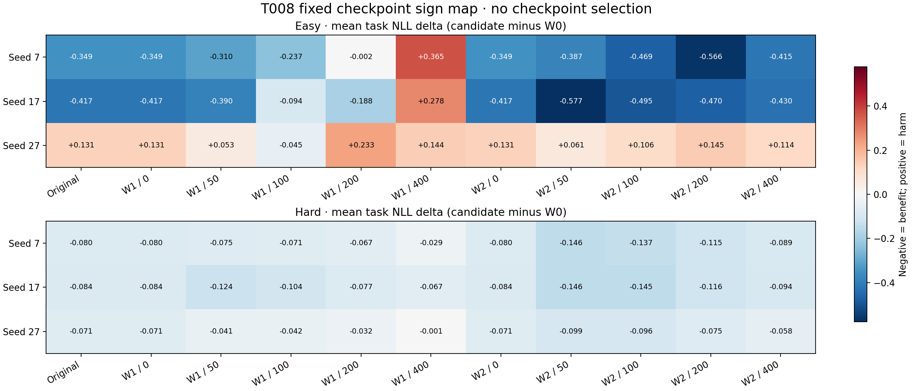
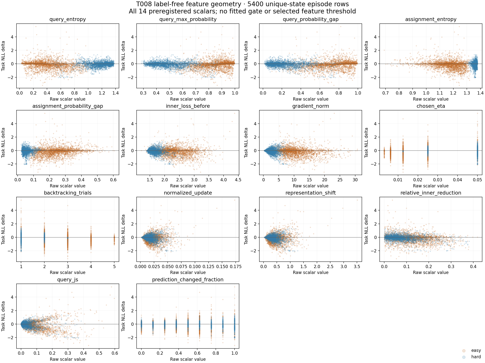
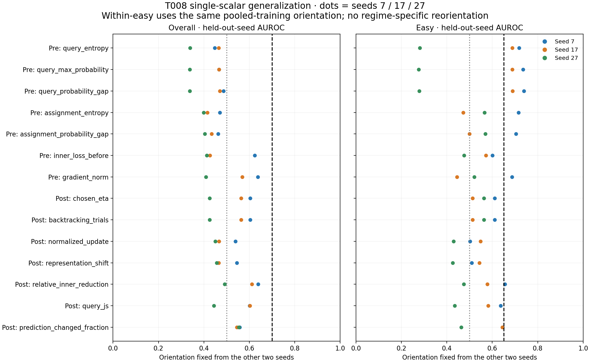

# T008 state-dependent adaptation observability audit

Run `20260912-101332-tovd-t008-a6000`; tested `153ac30d00753b43a56ce2e226068b0c35039d70`; preregistration `c163c78`.

Validity: **PASS**. Passing pre-update scalars: **none**. Passing post-candidate scalars: **none**.

No single preregistered label-free scalar passes. Do not fit a rescue controller; current simple runtime geometry does not meet the required harm-observability standard.

33 frozen states x100 easy+100 hard episodes =6600 full rows. Primary5400 rows count the identical original/W1step0/W2step0 state only once perseed. Full-grid weighting sensitivity is also reported.
Spearman/AUROC use average ties. Positive score means harm in un-oriented tables; LOSO orientation comes only from the other2 seeds and is reused within easy/hard.
Three seeds, reused observations and14 planned scalar comparisons: these are diagnostic results, not independent confirmation of a deployable safety policy.

The strongest primary overall LOSO mean is post-candidate relative_inner_reduction:0.580556, folds0.638526/0.612029/0.491113. Best pre-update mean is gradient_norm:0.538529. Every feature fails the original overall.70/.65 requirement, so the negative conclusion does not depend on the extra quantification of within-easy nontriviality.
Within-easy descriptive query_probability_gap AUROC is.711724 (max probability.704789), but pooled-training fold orientations are[+1,+1,-1]; its easy fold AUROCs are.738984/.689356/.278598. Do not reorient using the held-out fold or reinterpret this as a validated easy-only policy.
The Delta_NLL>.05 sensitivity also remains weak: highest mean overallLOSO.559274 (relative_inner_reduction). Full-grid un-oriented correlations/AUROCs are close to the unique-state analysis; no duplicate weighting rescue is claimed.

## Scalar interpretation gate

Overall meanLOSO>=.70 and everyfold>=.65; easy mean>=.65 and everyfold>=.60; identical fold orientation and oriented W1/W2 AUROC>.5 overall/within easy.
Gradient norm is pre-update but requires an inner backward pass. Every post-candidate scalar requires paying for C2 and could only support rollback.

| Feature | Availability | Overall mean / min | Easy mean / min | Fold signs | Overall | Direction | Easy | Pass |
| --- | --- | --- | --- | --- | --- | --- | --- | --- |
| query_entropy | pre | 0.4174 / 0.3393 | 0.5624 / 0.2806 | [-1, -1, 1] | False | False | False | **False** |
| query_max_probability | pre | 0.4236 / 0.3379 | 0.5664 / 0.2757 | [1, 1, -1] | False | False | False | **False** |
| query_probability_gap | pre | 0.4315 / 0.3375 | 0.5690 / 0.2786 | [1, 1, -1] | False | False | False | **False** |
| assignment_entropy | pre | 0.4280 / 0.3992 | 0.5844 / 0.4720 | [-1, -1, 1] | False | False | False | **False** |
| assignment_probability_gap | pre | 0.4337 / 0.4045 | 0.5906 / 0.4992 | [1, 1, -1] | False | False | False | **False** |
| inner_loss_before | pre | 0.4882 / 0.4132 | 0.5497 / 0.4764 | [-1, 1, -1] | False | False | False | **False** |
| gradient_norm | pre | 0.5385 / 0.4087 | 0.5507 / 0.4447 | [-1, -1, -1] | False | True | False | **False** |
| chosen_eta | post/rollback | 0.5313 / 0.4259 | 0.5622 / 0.5134 | [1, 1, 1] | False | True | False | **False** |
| backtracking_trials | post/rollback | 0.5313 / 0.4259 | 0.5622 / 0.5134 | [-1, -1, -1] | False | True | False | **False** |
| normalized_update | post/rollback | 0.4853 / 0.4503 | 0.4930 / 0.4298 | [-1, 1, -1] | False | False | False | **False** |
| representation_shift | post/rollback | 0.4888 / 0.4564 | 0.4930 / 0.4253 | [-1, 1, -1] | False | False | False | **False** |
| relative_inner_reduction | post/rollback | 0.5806 / 0.4911 | 0.5696 / 0.4749 | [-1, -1, -1] | False | True | False | **False** |
| query_js | post/rollback | 0.5491 / 0.4440 | 0.5509 / 0.4339 | [-1, -1, -1] | False | True | False | **False** |
| prediction_changed_fraction | post/rollback | 0.5523 / 0.5458 | 0.5848 / 0.4637 | [-1, -1, -1] | False | True | False | **False** |

## Primary un-oriented single-feature relationships

Higher feature value predicts harm for AUROC>.5 and positive Spearman; inverse features can be oriented using training seeds only.

| Feature | Overall rho / AUROC | Easy rho / AUROC | Hard rho / AUROC | Full-grid AUROC |
| --- | --- | --- | --- | --- |
| query_entropy | 0.0146 / 0.4760 | -0.2610 / 0.3275 | 0.1343 / 0.5345 | 0.4810 |
| query_max_probability | 0.0046 / 0.5361 | 0.3054 / 0.7048 | -0.1247 / 0.4723 | 0.5317 |
| query_probability_gap | 0.0221 / 0.5449 | 0.3194 / 0.7117 | -0.0878 / 0.4911 | 0.5405 |
| assignment_entropy | -0.0004 / 0.4904 | -0.2206 / 0.4240 | 0.0022 / 0.4905 | 0.4982 |
| assignment_probability_gap | 0.0087 / 0.5142 | 0.2206 / 0.5838 | 0.0157 / 0.5131 | 0.5066 |
| inner_loss_before | -0.1506 / 0.4610 | -0.1081 / 0.4851 | -0.2016 / 0.4245 | 0.4595 |
| gradient_norm | -0.1500 / 0.4544 | -0.2011 / 0.4140 | -0.1480 / 0.4561 | 0.4513 |
| chosen_eta | 0.1008 / 0.5362 | 0.1535 / 0.5901 | -0.0833 / 0.4810 | 0.5376 |
| backtracking_trials | -0.1008 / 0.4638 | -0.1535 / 0.4099 | 0.0833 / 0.5190 | 0.4624 |
| normalized_update | -0.0787 / 0.4931 | 0.0307 / 0.5480 | -0.1807 / 0.4451 | 0.4939 |
| representation_shift | -0.0892 / 0.4868 | 0.0150 / 0.5400 | -0.1927 / 0.4378 | 0.4881 |
| relative_inner_reduction | -0.2136 / 0.4198 | -0.1737 / 0.4329 | -0.2378 / 0.4062 | 0.4180 |
| query_js | -0.2003 / 0.4455 | -0.2140 / 0.4387 | -0.1788 / 0.4538 | 0.4427 |
| prediction_changed_fraction | -0.1934 / 0.4356 | -0.2814 / 0.3985 | -0.1696 / 0.4537 | 0.4369 |

## Leave-one-seed-out primary and sensitivity

Sensitivity harm=Delta_NLL>.05 has its own training-seed orientation. It never determines the primary gate.

| Feature | Harm definition | Held seed | Train sign | Overall AUC | Easy AUC | Hard AUC |
| --- | --- | --- | --- | --- | --- | --- |
| query_entropy | primary | 7 | -1 | 0.4482 | 0.7180 | 0.4178 |
| query_entropy | primary | 17 | -1 | 0.4648 | 0.6885 | 0.4567 |
| query_entropy | primary | 27 | 1 | 0.3393 | 0.2806 | 0.4786 |
| query_entropy | sensitivity_gt_005 | 7 | -1 | 0.4088 | 0.6020 | 0.4471 |
| query_entropy | sensitivity_gt_005 | 17 | -1 | 0.4555 | 0.6086 | 0.4748 |
| query_entropy | sensitivity_gt_005 | 27 | 1 | 0.3492 | 0.3452 | 0.4505 |
| query_max_probability | primary | 7 | 1 | 0.4660 | 0.7355 | 0.4329 |
| query_max_probability | primary | 17 | 1 | 0.4668 | 0.6881 | 0.4640 |
| query_max_probability | primary | 27 | -1 | 0.3379 | 0.2757 | 0.4778 |
| query_max_probability | sensitivity_gt_005 | 7 | 1 | 0.4244 | 0.6234 | 0.4540 |
| query_max_probability | sensitivity_gt_005 | 17 | 1 | 0.4566 | 0.6094 | 0.4780 |
| query_max_probability | sensitivity_gt_005 | 27 | -1 | 0.3505 | 0.3437 | 0.4586 |
| query_probability_gap | primary | 7 | 1 | 0.4870 | 0.7390 | 0.4793 |
| query_probability_gap | primary | 17 | 1 | 0.4700 | 0.6894 | 0.4709 |
| query_probability_gap | primary | 27 | -1 | 0.3375 | 0.2786 | 0.4733 |
| query_probability_gap | sensitivity_gt_005 | 7 | 1 | 0.4409 | 0.6273 | 0.4865 |
| query_probability_gap | sensitivity_gt_005 | 17 | 1 | 0.4594 | 0.6108 | 0.4847 |
| query_probability_gap | sensitivity_gt_005 | 27 | -1 | 0.3522 | 0.3468 | 0.4629 |
| assignment_entropy | primary | 7 | -1 | 0.4697 | 0.7154 | 0.5276 |
| assignment_entropy | primary | 17 | -1 | 0.4151 | 0.4720 | 0.4523 |
| assignment_entropy | primary | 27 | 1 | 0.3992 | 0.5659 | 0.4503 |
| assignment_entropy | sensitivity_gt_005 | 7 | -1 | 0.4490 | 0.7057 | 0.5465 |
| assignment_entropy | sensitivity_gt_005 | 17 | -1 | 0.4283 | 0.4894 | 0.4687 |
| assignment_entropy | sensitivity_gt_005 | 27 | 1 | 0.4029 | 0.5627 | 0.4445 |
| assignment_probability_gap | primary | 7 | 1 | 0.4629 | 0.7037 | 0.5114 |
| assignment_probability_gap | primary | 17 | 1 | 0.4336 | 0.4992 | 0.4935 |
| assignment_probability_gap | primary | 27 | -1 | 0.4045 | 0.5688 | 0.4692 |
| assignment_probability_gap | sensitivity_gt_005 | 7 | 1 | 0.4472 | 0.6879 | 0.5516 |
| assignment_probability_gap | sensitivity_gt_005 | 17 | 1 | 0.4320 | 0.4977 | 0.4735 |
| assignment_probability_gap | sensitivity_gt_005 | 27 | -1 | 0.4181 | 0.5805 | 0.4910 |
| inner_loss_before | primary | 7 | -1 | 0.6242 | 0.6007 | 0.5736 |
| inner_loss_before | primary | 17 | 1 | 0.4271 | 0.5719 | 0.4172 |
| inner_loss_before | primary | 27 | -1 | 0.4132 | 0.4764 | 0.5739 |
| inner_loss_before | sensitivity_gt_005 | 7 | -1 | 0.5913 | 0.5245 | 0.5291 |
| inner_loss_before | sensitivity_gt_005 | 17 | 1 | 0.4629 | 0.6225 | 0.4904 |
| inner_loss_before | sensitivity_gt_005 | 27 | -1 | 0.3922 | 0.4447 | 0.5103 |
| gradient_norm | primary | 7 | -1 | 0.6381 | 0.6867 | 0.5450 |
| gradient_norm | primary | 17 | -1 | 0.5688 | 0.4447 | 0.5608 |
| gradient_norm | primary | 27 | -1 | 0.4087 | 0.5208 | 0.5267 |
| gradient_norm | sensitivity_gt_005 | 7 | 1 | 0.3772 | 0.3452 | 0.5286 |
| gradient_norm | sensitivity_gt_005 | 17 | 1 | 0.4653 | 0.5696 | 0.5354 |
| gradient_norm | sensitivity_gt_005 | 27 | -1 | 0.3897 | 0.5000 | 0.4539 |
| chosen_eta | primary | 7 | 1 | 0.6041 | 0.6103 | 0.4818 |
| chosen_eta | primary | 17 | 1 | 0.5638 | 0.5134 | 0.4941 |
| chosen_eta | primary | 27 | 1 | 0.4259 | 0.5631 | 0.4684 |
| chosen_eta | sensitivity_gt_005 | 7 | 1 | 0.6288 | 0.6783 | 0.4667 |
| chosen_eta | sensitivity_gt_005 | 17 | 1 | 0.5656 | 0.5484 | 0.4830 |
| chosen_eta | sensitivity_gt_005 | 27 | 1 | 0.4382 | 0.5847 | 0.4643 |
| backtracking_trials | primary | 7 | -1 | 0.6041 | 0.6103 | 0.4818 |
| backtracking_trials | primary | 17 | -1 | 0.5638 | 0.5134 | 0.4941 |
| backtracking_trials | primary | 27 | -1 | 0.4259 | 0.5631 | 0.4684 |
| backtracking_trials | sensitivity_gt_005 | 7 | -1 | 0.6288 | 0.6783 | 0.4667 |
| backtracking_trials | sensitivity_gt_005 | 17 | -1 | 0.5656 | 0.5484 | 0.4830 |
| backtracking_trials | sensitivity_gt_005 | 27 | -1 | 0.4382 | 0.5847 | 0.4643 |
| normalized_update | primary | 7 | -1 | 0.5391 | 0.5016 | 0.5575 |
| normalized_update | primary | 17 | 1 | 0.4664 | 0.5478 | 0.4451 |
| normalized_update | primary | 27 | -1 | 0.4503 | 0.4298 | 0.5501 |
| normalized_update | sensitivity_gt_005 | 7 | 1 | 0.5340 | 0.6008 | 0.5090 |
| normalized_update | sensitivity_gt_005 | 17 | 1 | 0.5373 | 0.6036 | 0.5400 |
| normalized_update | sensitivity_gt_005 | 27 | 1 | 0.6011 | 0.6141 | 0.5244 |
| representation_shift | primary | 7 | -1 | 0.5450 | 0.5100 | 0.5658 |
| representation_shift | primary | 17 | 1 | 0.4651 | 0.5438 | 0.4432 |
| representation_shift | primary | 27 | -1 | 0.4564 | 0.4253 | 0.5618 |
| representation_shift | sensitivity_gt_005 | 7 | 1 | 0.5233 | 0.5864 | 0.4947 |
| representation_shift | sensitivity_gt_005 | 17 | 1 | 0.5341 | 0.5937 | 0.5383 |
| representation_shift | sensitivity_gt_005 | 27 | 1 | 0.5963 | 0.6180 | 0.5121 |
| relative_inner_reduction | primary | 7 | -1 | 0.6385 | 0.6562 | 0.5994 |
| relative_inner_reduction | primary | 17 | -1 | 0.6120 | 0.5776 | 0.5891 |
| relative_inner_reduction | primary | 27 | -1 | 0.4911 | 0.4749 | 0.5967 |
| relative_inner_reduction | sensitivity_gt_005 | 7 | -1 | 0.6167 | 0.6272 | 0.5718 |
| relative_inner_reduction | sensitivity_gt_005 | 17 | -1 | 0.5948 | 0.6067 | 0.5320 |
| relative_inner_reduction | sensitivity_gt_005 | 27 | -1 | 0.4662 | 0.4826 | 0.5280 |
| query_js | primary | 7 | -1 | 0.6009 | 0.6371 | 0.5112 |
| query_js | primary | 17 | -1 | 0.6025 | 0.5816 | 0.5590 |
| query_js | primary | 27 | -1 | 0.4440 | 0.4339 | 0.5652 |
| query_js | sensitivity_gt_005 | 7 | 1 | 0.5184 | 0.5403 | 0.5804 |
| query_js | sensitivity_gt_005 | 17 | 1 | 0.5051 | 0.5548 | 0.5458 |
| query_js | sensitivity_gt_005 | 27 | 1 | 0.6358 | 0.6723 | 0.5151 |
| prediction_changed_fraction | primary | 7 | -1 | 0.5575 | 0.6459 | 0.5529 |
| prediction_changed_fraction | primary | 17 | -1 | 0.5458 | 0.6449 | 0.5074 |
| prediction_changed_fraction | primary | 27 | -1 | 0.5535 | 0.4637 | 0.5782 |
| prediction_changed_fraction | sensitivity_gt_005 | 7 | 1 | 0.5260 | 0.4858 | 0.4940 |
| prediction_changed_fraction | sensitivity_gt_005 | 17 | 1 | 0.5393 | 0.4577 | 0.5692 |
| prediction_changed_fraction | sensitivity_gt_005 | 27 | 1 | 0.5174 | 0.6193 | 0.4807 |

## Fixed checkpoint sign map

All snapshots diagnostic; no method/checkpoint selected. Accuracy is percent.

| Branch | Seed | Step | Regime | W0 acc | C2 acc | W0 NLL | C2 NLL | Delta NLL | Sign |
| --- | --- | --- | --- | --- | --- | --- | --- | --- | --- |
| P_C2_warm | 17 | 0 | easy | 71.750 | 88.875 | 0.726271 | 0.309625 | -0.416647 | benefit |
| P_C2_warm | 17 | 0 | hard | 42.875 | 48.750 | 1.293194 | 1.209167 | -0.084027 | benefit |
| P_C2_warm | 17 | 100 | easy | 62.625 | 85.250 | 0.891974 | 0.397456 | -0.494518 | benefit |
| P_C2_warm | 17 | 100 | hard | 39.000 | 46.750 | 1.321007 | 1.176246 | -0.144761 | benefit |
| P_C2_warm | 17 | 200 | easy | 66.750 | 89.375 | 0.759955 | 0.289470 | -0.470485 | benefit |
| P_C2_warm | 17 | 200 | hard | 40.375 | 47.000 | 1.304536 | 1.188236 | -0.116300 | benefit |
| P_C2_warm | 17 | 400 | easy | 71.000 | 92.000 | 0.663572 | 0.233569 | -0.430004 | benefit |
| P_C2_warm | 17 | 400 | hard | 40.625 | 46.125 | 1.294714 | 1.201086 | -0.093628 | benefit |
| P_C2_warm | 17 | 50 | easy | 60.000 | 88.375 | 0.993032 | 0.416080 | -0.576951 | benefit |
| P_C2_warm | 17 | 50 | hard | 39.125 | 46.375 | 1.325396 | 1.179319 | -0.146077 | benefit |
| P_O0_resume | 17 | 0 | easy | 71.750 | 88.875 | 0.726271 | 0.309625 | -0.416647 | benefit |
| P_O0_resume | 17 | 0 | hard | 42.875 | 48.750 | 1.293194 | 1.209167 | -0.084027 | benefit |
| P_O0_resume | 17 | 100 | easy | 77.000 | 84.625 | 0.506891 | 0.412881 | -0.094010 | benefit |
| P_O0_resume | 17 | 100 | hard | 41.250 | 46.125 | 1.277874 | 1.173913 | -0.103962 | benefit |
| P_O0_resume | 17 | 200 | easy | 71.125 | 82.125 | 0.623246 | 0.434871 | -0.188374 | benefit |
| P_O0_resume | 17 | 200 | hard | 41.375 | 45.750 | 1.283836 | 1.207142 | -0.076694 | benefit |
| P_O0_resume | 17 | 400 | easy | 68.375 | 68.125 | 0.573387 | 0.851133 | +0.277746 | harm |
| P_O0_resume | 17 | 400 | hard | 38.500 | 43.000 | 1.327307 | 1.260039 | -0.067268 | benefit |
| P_O0_resume | 17 | 50 | easy | 71.625 | 88.375 | 0.728966 | 0.339151 | -0.389815 | benefit |
| P_O0_resume | 17 | 50 | hard | 39.125 | 47.125 | 1.314299 | 1.190644 | -0.123655 | benefit |
| original_P | 17 | 0 | easy | 71.750 | 88.875 | 0.726271 | 0.309625 | -0.416647 | benefit |
| original_P | 17 | 0 | hard | 42.875 | 48.750 | 1.293194 | 1.209167 | -0.084027 | benefit |
| P_C2_warm | 27 | 0 | easy | 89.125 | 80.875 | 0.322851 | 0.454044 | +0.131193 | harm |
| P_C2_warm | 27 | 0 | hard | 37.625 | 41.375 | 1.331919 | 1.260512 | -0.071407 | benefit |
| P_C2_warm | 27 | 100 | easy | 85.875 | 78.000 | 0.406683 | 0.512699 | +0.106016 | harm |
| P_C2_warm | 27 | 100 | hard | 38.750 | 40.000 | 1.353244 | 1.257689 | -0.095556 | benefit |
| P_C2_warm | 27 | 200 | easy | 88.875 | 79.250 | 0.341039 | 0.486093 | +0.145055 | harm |
| P_C2_warm | 27 | 200 | hard | 39.250 | 39.500 | 1.331121 | 1.255692 | -0.075429 | benefit |
| P_C2_warm | 27 | 400 | easy | 92.500 | 84.875 | 0.242851 | 0.357217 | +0.114365 | harm |
| P_C2_warm | 27 | 400 | hard | 38.125 | 40.000 | 1.300122 | 1.241953 | -0.058168 | benefit |
| P_C2_warm | 27 | 50 | easy | 86.875 | 81.875 | 0.395054 | 0.455974 | +0.060920 | harm |
| P_C2_warm | 27 | 50 | hard | 39.500 | 43.000 | 1.346215 | 1.247367 | -0.098848 | benefit |
| P_O0_resume | 27 | 0 | easy | 89.125 | 80.875 | 0.322851 | 0.454044 | +0.131193 | harm |
| P_O0_resume | 27 | 0 | hard | 37.625 | 41.375 | 1.331919 | 1.260512 | -0.071407 | benefit |
| P_O0_resume | 27 | 100 | easy | 85.125 | 84.875 | 0.419511 | 0.374374 | -0.045137 | benefit |
| P_O0_resume | 27 | 100 | hard | 40.125 | 43.750 | 1.279339 | 1.237204 | -0.042135 | benefit |
| P_O0_resume | 27 | 200 | easy | 88.750 | 75.625 | 0.299564 | 0.532191 | +0.232627 | harm |
| P_O0_resume | 27 | 200 | hard | 41.125 | 45.625 | 1.253320 | 1.221052 | -0.032268 | benefit |
| P_O0_resume | 27 | 400 | easy | 88.125 | 79.000 | 0.305114 | 0.449139 | +0.144025 | harm |
| P_O0_resume | 27 | 400 | hard | 42.625 | 46.375 | 1.186915 | 1.186390 | -0.000526 | benefit |
| P_O0_resume | 27 | 50 | easy | 87.000 | 82.625 | 0.361953 | 0.414717 | +0.052764 | harm |
| P_O0_resume | 27 | 50 | hard | 39.000 | 40.750 | 1.274814 | 1.234181 | -0.040632 | benefit |
| original_P | 27 | 0 | easy | 89.125 | 80.875 | 0.322851 | 0.454044 | +0.131193 | harm |
| original_P | 27 | 0 | hard | 37.625 | 41.375 | 1.331919 | 1.260512 | -0.071407 | benefit |
| P_C2_warm | 7 | 0 | easy | 71.875 | 90.375 | 0.618636 | 0.269794 | -0.348842 | benefit |
| P_C2_warm | 7 | 0 | hard | 41.125 | 48.625 | 1.316601 | 1.236403 | -0.080198 | benefit |
| P_C2_warm | 7 | 100 | easy | 65.250 | 90.625 | 0.787860 | 0.318714 | -0.469147 | benefit |
| P_C2_warm | 7 | 100 | hard | 37.500 | 46.750 | 1.363607 | 1.226719 | -0.136888 | benefit |
| P_C2_warm | 7 | 200 | easy | 62.000 | 93.000 | 0.859756 | 0.293427 | -0.566329 | benefit |
| P_C2_warm | 7 | 200 | hard | 38.500 | 45.625 | 1.356298 | 1.241373 | -0.114925 | benefit |
| P_C2_warm | 7 | 400 | easy | 68.000 | 89.750 | 0.741902 | 0.326773 | -0.415129 | benefit |
| P_C2_warm | 7 | 400 | hard | 38.000 | 44.500 | 1.329756 | 1.240744 | -0.089012 | benefit |
| P_C2_warm | 7 | 50 | easy | 68.625 | 93.625 | 0.682934 | 0.295698 | -0.387236 | benefit |
| P_C2_warm | 7 | 50 | hard | 36.375 | 46.375 | 1.374547 | 1.229014 | -0.145533 | benefit |
| P_O0_resume | 7 | 0 | easy | 71.875 | 90.375 | 0.618636 | 0.269794 | -0.348842 | benefit |
| P_O0_resume | 7 | 0 | hard | 41.125 | 48.625 | 1.316601 | 1.236403 | -0.080198 | benefit |
| P_O0_resume | 7 | 100 | easy | 77.500 | 89.125 | 0.523955 | 0.287447 | -0.236508 | benefit |
| P_O0_resume | 7 | 100 | hard | 44.000 | 48.750 | 1.272199 | 1.201294 | -0.070906 | benefit |
| P_O0_resume | 7 | 200 | easy | 83.000 | 83.750 | 0.400546 | 0.398072 | -0.002473 | benefit |
| P_O0_resume | 7 | 200 | hard | 42.625 | 48.250 | 1.274116 | 1.206823 | -0.067294 | benefit |
| P_O0_resume | 7 | 400 | easy | 86.375 | 75.375 | 0.335840 | 0.701003 | +0.365164 | harm |
| P_O0_resume | 7 | 400 | hard | 41.500 | 46.750 | 1.243157 | 1.214545 | -0.028612 | benefit |
| P_O0_resume | 7 | 50 | easy | 74.000 | 88.375 | 0.601790 | 0.291733 | -0.310057 | benefit |
| P_O0_resume | 7 | 50 | hard | 41.375 | 48.750 | 1.297803 | 1.222359 | -0.075445 | benefit |
| original_P | 7 | 0 | easy | 71.875 | 90.375 | 0.618636 | 0.269794 | -0.348842 | benefit |
| original_P | 7 | 0 | hard | 41.125 | 48.625 | 1.316601 | 1.236403 | -0.080198 | benefit |

## Failure localization

Groups use task labels only offline. Values below are group means; full medians/quartiles and branch-stratified values in localization.csv. Drift is not a candidate predictor.

| Regime | Group | Count | Query entropy | Max probability | Assignment entropy | Normalized update | Representation shift | Relative inner reduction | Query JS | Drift W0 |
| --- | --- | --- | --- | --- | --- | --- | --- | --- | --- | --- |
| primary/easy | harm | 1087 | 0.3425 | 0.8862 | 1.1407 | 0.0237 | 0.4778 | 0.1089 | 0.0798 | 1.0009 |
| primary/easy | benefit | 1613 | 0.4762 | 0.8148 | 1.1670 | 0.0212 | 0.4317 | 0.1261 | 0.0909 | 0.9022 |
| primary/hard | harm | 1148 | 1.1744 | 0.4774 | 1.3600 | 0.0158 | 0.3206 | 0.0621 | 0.0314 | 0.9361 |
| primary/hard | benefit | 1552 | 1.1611 | 0.4867 | 1.3612 | 0.0173 | 0.3553 | 0.0813 | 0.0368 | 0.9463 |

Easy harm is associated descriptively with more confident W0 (max probability.886158 vs.814840; entropy.342544 vs.476213). Its normalized update/representation shift are slightly larger (.023671/.477821 vs.021180/.431671).
However, harmful easy episodes have smaller predictive JS (.079785 vs.090923), fewer changed top1 predictions (.191927 vs.269141), and smaller relative inner descent (.108913 vs.126109). Thus confident-W0 overspecialization is only a partial qualitative explanation; a universal confident-plus-large-predictive-change detector is not supported by these quantities or the LOSO gate.
Easy W1 seeds7/17 change from beneficial initial means to harmful step400 means (+.365164/+.277746). Easy seed27 is already harmful at the original state (+.131193); W2 remains harmful at every saved step. All33 hard state/regime means remain beneficial, despite1148/2700 unique hard episodes being individually harmful.
Primary harm prevalence:2235/5400 overall,1087/2700 easy,1148/2700 hard; no exactly neutral episodes. State-average benefit does not determine the sign for an individual episode.

## Validity and artifact contract

```json
{
  "source_hashes_match": true,
  "state_count": 33,
  "row_count": 6600,
  "expected_row_count": 6600,
  "historical_max_error": 0.0,
  "T005_max_error": 0.0,
  "historical_stream_mismatches": 0,
  "normal_oracle_bitwise_equal": true,
  "features_exact": true,
  "output_max_error": 0.0,
  "state_max_error": 0.0,
  "pre_inner_loss_max_error": 0.0,
  "pre_gradient_max_error": 0.0,
  "nonfinite_features": 0,
  "all_outputs_finite": true,
  "parameters_unchanged": true,
  "passes": true
}
```

Original/T005 and all T007 trajectory metrics/episode identities replayed; schema explicitly separates14 label-free predictors from outcomes/metadata.
Complete per-episode W0/C2 tokens, query probabilities, candidate diagnostics, labels/IDs and oracle-on/off checks are in original run records/. Parameters/checkpoints never train or mutate.
All gate conditions were fixed before correlation outcomes. Constant correlations/single-class AUROCs are undefined, not substituted with favorable values.
No p-values or independent-row confidence intervals; folds split entire seeds. A future policy would need training-only calibration and separate validation.






