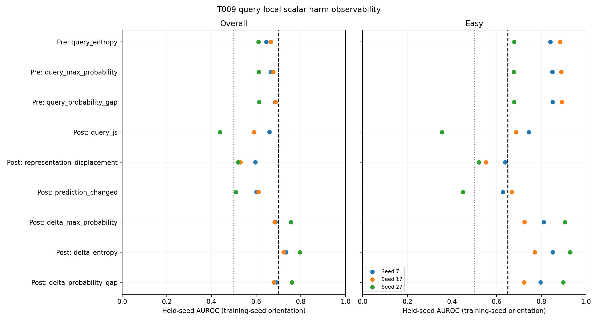
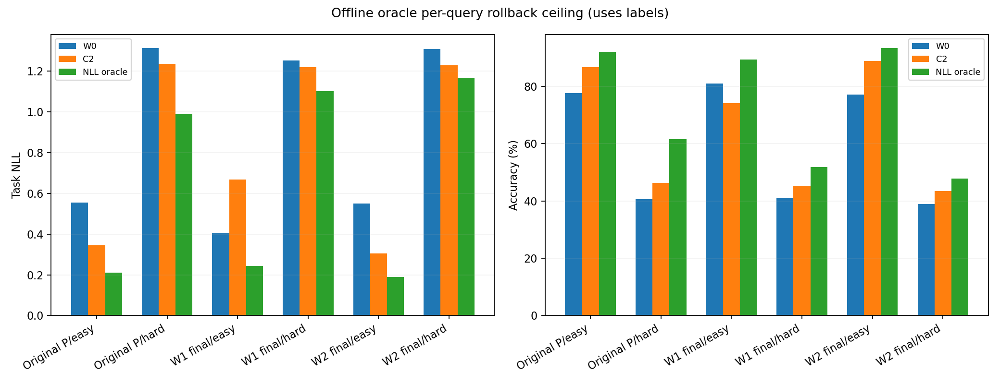
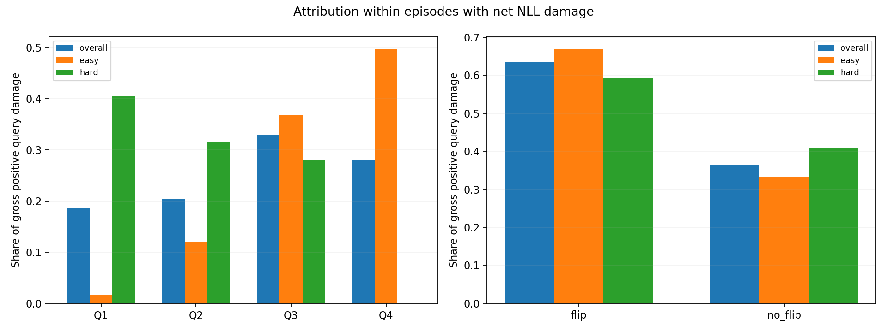

# T009 query-local harm decomposition

Source `1d9915b06befaf509b912e3328491e3a8b263522`; preregistration `1b63bf6`; tested `3e56b0cca890ea83873e48ee68f69593b78af9b7`.

Engineering validity **PASS**. Condition A **PASS**. Condition B **PASS**.

Frozen logs only: 54 hashed files, 27 unique states, 5400 episodes and 43200 queries; 14400 queries per seed. No model rerun or training.

Recommend a separately preregistered T010 only if both A and B pass. Otherwise no controller implementation. A passes; the B result determines whether query-level selectivity has sufficient oracle headroom.

## Single-feature interpretation gate

A requires overall LOSO mean >=.70 / every fold >=.65; easy mean >=.65 / every fold >=.60, same training-seed orientation and consistent W1/W2 direction. Post-candidate features require paying for C2; they can only motivate later rollback/output fusion.

| Feature | Availability | Overall mean / min | Easy mean / min | Fold signs | Direction | Pass |
| --- | --- | --- | --- | --- | --- | --- |
| query_entropy | pre | 0.640142 / 0.610202 | 0.800467 / 0.677282 | [-1, -1, -1] | True | False |
| query_max_probability | pre | 0.651315 / 0.611729 | 0.804716 / 0.676752 | [1, 1, 1] | True | False |
| query_probability_gap | pre | 0.660792 / 0.612954 | 0.806699 / 0.677807 | [1, 1, 1] | True | False |
| query_js | post | 0.561975 / 0.437961 | 0.595309 / 0.355235 | [-1, -1, -1] | True | False |
| representation_displacement | post | 0.548288 / 0.519127 | 0.569835 / 0.520293 | [-1, -1, -1] | True | False |
| prediction_changed | post | 0.573357 / 0.508472 | 0.581335 / 0.449021 | [-1, -1, -1] | True | False |
| delta_max_probability | post | 0.708225 / 0.682447 | 0.813241 / 0.724038 | [-1, -1, -1] | True | True |
| delta_entropy | post | 0.750696 / 0.722485 | 0.850020 / 0.770398 | [1, 1, 1] | True | True |
| delta_probability_gap | post | 0.709433 / 0.678763 | 0.805801 / 0.723427 | [-1, -1, -1] | True | True |

## Primary descriptive relationships

AUROC uses the raw feature sign; orientation is learned only on other seeds for LOSO. Complete per-state/branch/step results and direction consistency are in CSVs.

| Feature | Overall rho / AUC | Easy rho / AUC | Hard rho / AUC |
| --- | --- | --- | --- |
| query_entropy | -0.14838 / 0.36176 | -0.43574 / 0.19510 | 0.02127 / 0.46577 |
| query_max_probability | 0.17159 / 0.64960 | 0.44994 / 0.81144 | -0.01638 / 0.53957 |
| query_probability_gap | 0.19750 / 0.66051 | 0.45660 / 0.81486 | 0.00243 / 0.54603 |
| query_js | -0.16306 / 0.43901 | -0.13983 / 0.40382 | -0.20133 / 0.44480 |
| representation_displacement | -0.10816 / 0.45596 | -0.05385 / 0.44226 | -0.18965 / 0.44694 |
| prediction_changed | -0.20408 / 0.42543 | -0.23726 / 0.41756 | -0.16301 / 0.44672 |
| delta_max_probability | -0.28215 / 0.29023 | -0.49732 / 0.18066 | -0.03218 / 0.42056 |
| delta_entropy | 0.31615 / 0.75025 | 0.54036 / 0.85214 | 0.02496 / 0.57612 |
| delta_probability_gap | -0.28135 / 0.28912 | -0.48365 / 0.18784 | -0.03960 / 0.42523 |

## LOSO folds and sensitivity

| Feature | Definition | Seed | Train sign | Overall AUC | Easy AUC | Hard AUC |
| --- | --- | --- | --- | --- | --- | --- |
| query_entropy | primary | 7 | -1 | 0.644860 | 0.840509 | 0.548056 |
| query_entropy | primary | 17 | -1 | 0.665363 | 0.883611 | 0.522484 |
| query_entropy | primary | 27 | -1 | 0.610202 | 0.677282 | 0.550079 |
| query_entropy | sensitivity_gt_005 | 7 | -1 | 0.492286 | 0.608596 | 0.578312 |
| query_entropy | sensitivity_gt_005 | 17 | -1 | 0.563480 | 0.726404 | 0.523196 |
| query_entropy | sensitivity_gt_005 | 27 | -1 | 0.559832 | 0.571171 | 0.562824 |
| query_max_probability | primary | 7 | 1 | 0.666111 | 0.848423 | 0.560128 |
| query_max_probability | primary | 17 | 1 | 0.676104 | 0.888974 | 0.525993 |
| query_max_probability | primary | 27 | 1 | 0.611729 | 0.676752 | 0.550127 |
| query_max_probability | sensitivity_gt_005 | 7 | 1 | 0.516369 | 0.618344 | 0.588218 |
| query_max_probability | sensitivity_gt_005 | 17 | 1 | 0.574618 | 0.730728 | 0.528049 |
| query_max_probability | sensitivity_gt_005 | 27 | 1 | 0.558648 | 0.569595 | 0.555331 |
| query_probability_gap | primary | 7 | 1 | 0.683493 | 0.850975 | 0.575704 |
| query_probability_gap | primary | 17 | 1 | 0.685929 | 0.891314 | 0.524312 |
| query_probability_gap | primary | 27 | 1 | 0.612954 | 0.677807 | 0.550826 |
| query_probability_gap | sensitivity_gt_005 | 7 | 1 | 0.534148 | 0.621218 | 0.599187 |
| query_probability_gap | sensitivity_gt_005 | 17 | 1 | 0.584266 | 0.732111 | 0.527829 |
| query_probability_gap | sensitivity_gt_005 | 27 | 1 | 0.557221 | 0.570011 | 0.550298 |
| query_js | primary | 7 | -1 | 0.658644 | 0.743297 | 0.559745 |
| query_js | primary | 17 | -1 | 0.589321 | 0.687396 | 0.543313 |
| query_js | primary | 27 | -1 | 0.437961 | 0.355235 | 0.555670 |
| query_js | sensitivity_gt_005 | 7 | 1 | 0.516175 | 0.573276 | 0.484818 |
| query_js | sensitivity_gt_005 | 17 | 1 | 0.535292 | 0.556237 | 0.494923 |
| query_js | sensitivity_gt_005 | 27 | 1 | 0.664860 | 0.792543 | 0.516587 |
| representation_displacement | primary | 7 | -1 | 0.595952 | 0.637403 | 0.561088 |
| representation_displacement | primary | 17 | -1 | 0.529785 | 0.551809 | 0.545359 |
| representation_displacement | primary | 27 | -1 | 0.519127 | 0.520293 | 0.548169 |
| representation_displacement | sensitivity_gt_005 | 7 | 1 | 0.494876 | 0.540298 | 0.475797 |
| representation_displacement | sensitivity_gt_005 | 17 | 1 | 0.513545 | 0.550781 | 0.487211 |
| representation_displacement | sensitivity_gt_005 | 27 | 1 | 0.522511 | 0.523288 | 0.515985 |
| prediction_changed | primary | 7 | -1 | 0.601815 | 0.627277 | 0.568320 |
| prediction_changed | primary | 17 | -1 | 0.609785 | 0.667706 | 0.533356 |
| prediction_changed | primary | 27 | -1 | 0.508472 | 0.449021 | 0.551639 |
| prediction_changed | sensitivity_gt_005 | 7 | -1 | 0.527316 | 0.534091 | 0.548260 |
| prediction_changed | sensitivity_gt_005 | 17 | 1 | 0.454167 | 0.418675 | 0.488243 |
| prediction_changed | sensitivity_gt_005 | 27 | -1 | 0.468927 | 0.407825 | 0.524729 |
| delta_max_probability | primary | 7 | -1 | 0.686706 | 0.810176 | 0.584325 |
| delta_max_probability | primary | 17 | -1 | 0.682447 | 0.724038 | 0.601285 |
| delta_max_probability | primary | 27 | -1 | 0.755522 | 0.905510 | 0.564368 |
| delta_max_probability | sensitivity_gt_005 | 7 | -1 | 0.731545 | 0.843938 | 0.610178 |
| delta_max_probability | sensitivity_gt_005 | 17 | -1 | 0.717821 | 0.813498 | 0.611580 |
| delta_max_probability | sensitivity_gt_005 | 27 | -1 | 0.771228 | 0.906703 | 0.585422 |
| delta_entropy | primary | 7 | 1 | 0.734267 | 0.850789 | 0.577050 |
| delta_entropy | primary | 17 | 1 | 0.722485 | 0.770398 | 0.601898 |
| delta_entropy | primary | 27 | 1 | 0.795335 | 0.928874 | 0.566153 |
| delta_entropy | sensitivity_gt_005 | 7 | 1 | 0.743774 | 0.860751 | 0.605249 |
| delta_entropy | sensitivity_gt_005 | 17 | 1 | 0.732589 | 0.853235 | 0.610831 |
| delta_entropy | sensitivity_gt_005 | 27 | 1 | 0.796518 | 0.918397 | 0.589699 |
| delta_probability_gap | primary | 7 | -1 | 0.689780 | 0.796245 | 0.592975 |
| delta_probability_gap | primary | 17 | -1 | 0.678763 | 0.723427 | 0.578737 |
| delta_probability_gap | primary | 27 | -1 | 0.759755 | 0.897732 | 0.563580 |
| delta_probability_gap | sensitivity_gt_005 | 7 | -1 | 0.727774 | 0.832133 | 0.618140 |
| delta_probability_gap | sensitivity_gt_005 | 17 | -1 | 0.711051 | 0.810744 | 0.589435 |
| delta_probability_gap | sensitivity_gt_005 | 27 | -1 | 0.769731 | 0.900466 | 0.579923 |

## Oracle per-query rollback ceiling

Choose the lower true-class NLL per query, W0 on ties. Accuracy is measured from that chosen output; this is not a separately optimized accuracy oracle. Labels are used only offline. Values are aggregate means; accuracy shown as percent.

| State group | W0 acc | C2 acc | Oracle acc | W0 NLL | C2 NLL | Oracle NLL |
| --- | --- | --- | --- | --- | --- | --- |
| focus/original_P/easy | 77.5833 | 86.7083 | 92.1250 | 0.555919 | 0.344488 | 0.210326 |
| focus/original_P/hard | 40.5417 | 46.2500 | 61.5000 | 1.313905 | 1.235361 | 0.987770 |
| focus/P_O0_resume/easy | 80.9583 | 74.1667 | 89.4583 | 0.404780 | 0.667092 | 0.242742 |
| focus/P_O0_resume/hard | 40.8750 | 45.3750 | 51.8333 | 1.252460 | 1.220324 | 1.100422 |
| focus/P_C2_warm/easy | 77.1667 | 88.8750 | 93.4167 | 0.549442 | 0.305853 | 0.188944 |
| focus/P_C2_warm/hard | 38.9167 | 43.5417 | 47.7500 | 1.308197 | 1.227928 | 1.167493 |

B requires >=95% of positive hard C2 gain retained for each original/final branch and both metrics (no degradation if no gain), plus >=80% removal of each observed easy original/final seed-state regression. Units below are NLL or accuracy fraction.

| Scope | Clause | Metric | C2 gain/regression | Oracle gain/removed | Required | Pass |
| --- | --- | --- | --- | --- | --- | --- |
| focus/original_P/hard | hard_gain | nll | 0.078544 | 0.326135 | 0.074617 | True |
| focus/original_P/hard | hard_gain | accuracy | 0.057083 | 0.209583 | 0.054229 | True |
| focus/P_O0_resume/hard | hard_gain | nll | 0.032135 | 0.152038 | 0.030529 | True |
| focus/P_O0_resume/hard | hard_gain | accuracy | 0.045000 | 0.109583 | 0.042750 | True |
| focus/P_C2_warm/hard | hard_gain | nll | 0.080269 | 0.140705 | 0.076256 | True |
| focus/P_C2_warm/hard | hard_gain | accuracy | 0.046250 | 0.088333 | 0.043938 | True |
| state/seed7_P_O0_resume_step400/easy | easy_regression | nll | 0.365164 | 0.474486 | 0.292131 | True |
| state/seed7_P_O0_resume_step400/easy | easy_regression | accuracy | 0.110000 | 0.165000 | 0.088000 | True |
| state/seed17_P_O0_resume_step400/easy | easy_regression | nll | 0.277746 | 0.505344 | 0.222197 | True |
| state/seed17_P_O0_resume_step400/easy | easy_regression | accuracy | 0.002500 | 0.152500 | 0.002000 | True |
| state/seed27_original_P/easy | easy_regression | nll | 0.131193 | 0.260811 | 0.104955 | True |
| state/seed27_original_P/easy | easy_regression | accuracy | 0.082500 | 0.120000 | 0.066000 | True |
| state/seed27_P_O0_resume_step400/easy | easy_regression | nll | 0.144025 | 0.293219 | 0.115220 | True |
| state/seed27_P_O0_resume_step400/easy | easy_regression | accuracy | 0.091250 | 0.141250 | 0.073000 | True |
| state/seed27_P_C2_warm_step400/easy | easy_regression | nll | 0.114365 | 0.208800 | 0.091492 | True |
| state/seed27_P_C2_warm_step400/easy | easy_regression | accuracy | 0.076250 | 0.107500 | 0.061000 | True |

## Damage attribution

Global W0 confidence quartile boundaries: [0.4489953890442848, 0.626869261264801, 0.915282279253006]. Boundaries use label-free probabilities only; equal values go to the lower quartile. These are descriptive bins, not fitted deployment thresholds.

Only episodes with positive mean query NLL damage enter attribution. Net shares include negative offsets, so a bin can be negative or exceed 100%; gross shares use positive query damage only. Complete denominators and quartile x flip cross-tabs are in attribution.csv.

| Regime | Grouping | Group | Count | Net share | Gross positive share |
| --- | --- | --- | --- | --- | --- |
| overall | flip | flip | 5054 | 0.66409 | 0.63448 |
| overall | flip | no_flip | 12826 | 0.33591 | 0.36552 |
| overall | quartile | Q1 | 4729 | 0.16282 | 0.18658 |
| overall | quartile | Q2 | 3740 | 0.17912 | 0.20458 |
| overall | quartile | Q3 | 4107 | 0.33222 | 0.32953 |
| overall | quartile | Q4 | 5304 | 0.32584 | 0.27930 |
| easy | flip | flip | 1669 | 0.70453 | 0.66806 |
| easy | flip | no_flip | 7027 | 0.29547 | 0.33194 |
| easy | quartile | Q1 | 94 | 0.01265 | 0.01650 |
| easy | quartile | Q2 | 634 | 0.10684 | 0.11936 |
| easy | quartile | Q3 | 2664 | 0.34036 | 0.36769 |
| easy | quartile | Q4 | 5304 | 0.54015 | 0.49645 |
| hard | flip | flip | 3385 | 0.60259 | 0.59127 |
| hard | flip | no_flip | 5799 | 0.39741 | 0.40873 |
| hard | quartile | Q1 | 4635 | 0.39113 | 0.40536 |
| hard | quartile | Q2 | 3106 | 0.28903 | 0.31419 |
| hard | quartile | Q3 | 1443 | 0.31984 | 0.28045 |

## Correctness transitions

| Scope | Transition | NLL change | Count | Fraction | Mean delta |
| --- | --- | --- | --- | --- | --- |
| overall | correct->correct | improved | 9109 | 0.21086 | -0.160413 |
| overall | wrong->correct | improved | 6582 | 0.15236 | -1.014015 |
| overall | correct->correct | worsened | 12313 | 0.28502 | 0.175606 |
| overall | correct->wrong | worsened | 3713 | 0.08595 | 1.056657 |
| overall | wrong->wrong | improved | 7862 | 0.18199 | -0.555251 |
| overall | wrong->wrong | worsened | 3493 | 0.08086 | 0.349136 |
| overall | wrong->correct | worsened | 75 | 0.00174 | 0.073927 |
| overall | correct->wrong | improved | 53 | 0.00123 | -0.064073 |
| regime/easy | correct->correct | improved | 6230 | 0.28843 | -0.162976 |
| regime/easy | wrong->correct | improved | 3335 | 0.15440 | -1.461170 |
| regime/easy | correct->correct | worsened | 8735 | 0.40440 | 0.157423 |
| regime/easy | correct->wrong | worsened | 1584 | 0.07333 | 1.489485 |
| regime/easy | wrong->wrong | improved | 1335 | 0.06181 | -1.144180 |
| regime/easy | wrong->correct | worsened | 5 | 0.00023 | 0.080378 |
| regime/easy | wrong->wrong | worsened | 372 | 0.01722 | 0.839680 |
| regime/easy | correct->wrong | improved | 4 | 0.00019 | -0.200029 |
| regime/hard | wrong->wrong | worsened | 3121 | 0.14449 | 0.290666 |
| regime/hard | correct->correct | worsened | 3578 | 0.16565 | 0.219997 |
| regime/hard | wrong->wrong | improved | 6527 | 0.30218 | -0.434795 |
| regime/hard | wrong->correct | improved | 3247 | 0.15032 | -0.554742 |
| regime/hard | correct->correct | improved | 2879 | 0.13329 | -0.154866 |
| regime/hard | correct->wrong | worsened | 2129 | 0.09856 | 0.734628 |
| regime/hard | wrong->correct | worsened | 70 | 0.00324 | 0.073466 |
| regime/hard | correct->wrong | improved | 49 | 0.00227 | -0.052975 |

## Interpretation

Both A and B pass. Three post-candidate scalars pass: delta_entropy (mean overall LOSO .750696, minimum .722485; easy mean .850020, minimum .770398), delta_max_probability (.708225, minimum .682447) and delta_probability_gap (.709433, minimum .678763). None of the three pre-update scalars passes. All fold orientations agree; increasing entropy, or decreasing maximum probability/gap, predicts greater query NLL harm.

Delta-entropy oriented branch AUROCs are .753202/.744237 overall for W1/W2 and .853527/.852734 within easy. Its >.05 sensitivity fold AUROCs are .743774/.732589/.796518 overall. This supports a query-local post-candidate signal on this fixed grid; it does not establish a threshold, calibrated failure probability, detector transfer or actual rollback-policy performance.

Within net-harmed easy episodes, the highest global W0-confidence quartile contributes 54.01% of net NLL damage and 49.64% of gross positive damage. Prediction flips contribute 70.45% of net damage and 66.81% of gross positive damage; no-flip damage remains substantial. Within hard harmed episodes, global Q4 is empty (zero contribution), not missing evidence.

Across all queries, 3766 correct-to-wrong and 6657 wrong-to-correct transitions coexist; 12313 correct-to-correct queries still worsen NLL. NLL and top1 correctness do not coincide perfectly: 53 correct-to-wrong transitions improve NLL, and 75 wrong-to-correct transitions worsen it. The oracle uses the specified NLL criterion throughout.

The original hard NLL oracle reaches 61.50% accuracy / .987770 NLL versus C2 46.25% / 1.235361. Final W1 hard reaches 51.8333% / 1.100422; final W2 hard 47.75% / 1.167493. Final W1 easy changes from W0 80.9583% / .404780 through C2 74.1667% / .667092 to oracle 89.4583% / .242742. Final W2 easy seed 27 changes from W0 92.5% / .242851 through C2 84.875% / .357217 to oracle 95.625% / .148417. All predeclared B clauses pass, but these numbers use labels and are ceilings only.

Recommendation: Research Lead may preregister a separate T010 minimal per-query rollback/output-fusion experiment, calibrated on training data and tested separately. This audit implements no policy and does not reopen always-on C2 or detector integration.

## Reproducibility and limits

All source hashes match. Historical episode NLL max error 5.38e-07, delta max error 5.71e-07, accuracy error 0.0; historical query NLL max error 3.54e-07. Probability-log versus stored fused float32 cross-entropy accounts for rounding; primary query harm sign differences: 0.

Feature extraction repeated exactly, inherited oracle-on/off output checks all bitwise equal. All rows from each seed remain together; no random query split, no labels/IDs/regime in predictors, no thresholds fitted and no feature combinations. Nine predeclared scalars all reported. Optional logit margin omitted because raw logits were not stored.

Three seeds and heavily reused queries/checkpoints mean these are diagnostic results, not independent 43200-sample validation. No p-values or independent-query confidence intervals. Oracle headroom is not a realizable policy result.

Commands: `python -m pytest -q`; `python -m research_log.t009.audit --revision 3e56b0cca890ea83873e48ee68f69593b78af9b7 --output research_log/t009/results`; `python -m research_log.t009.write_report`.

Environment: {"revision": "3e56b0cca890ea83873e48ee68f69593b78af9b7", "preregistration": "1b63bf6", "source_commit": "1d9915b06befaf509b912e3328491e3a8b263522", "time_utc": "2026-09-12T02:56:48.741820+00:00", "python": "3.12.7", "platform": "Windows-11-10.0.26200-SP0", "device": "local CPU; stdlib only", "model_rerun": false}. Full local 90 tests passed in 26.18s. No CUDA-dependent work, so no A6000 rerun.

