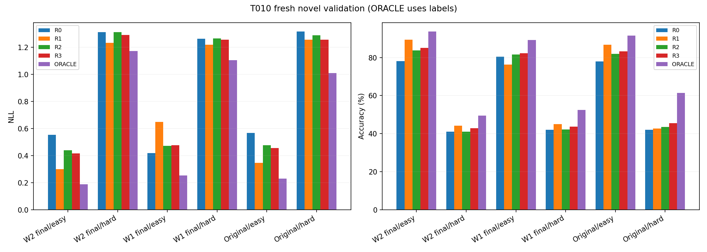
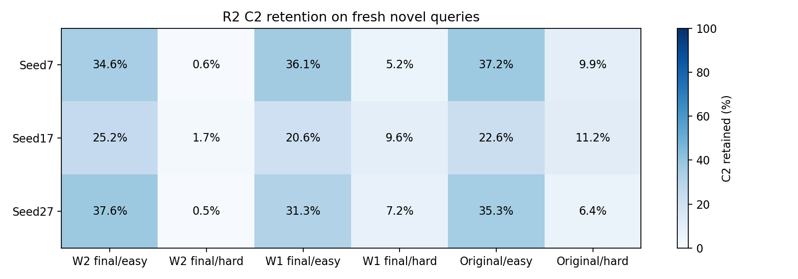

# T010 base-calibrated query rollback on fresh novel streams

Calibration run `20260912-114426-tovd-t010-cal-a6000`; validation run `20260912-120555-tovd-t010-val-a6000`.
Preregistration `396d903`; tested `1b60f217f67c283df1e49f73f4bb4f2b64e03955`; actual threshold commit `bbfaa8608d259527f88c996d7ad61420bb7af41f`.

**Engineering validity PASS. Confirmatory result FAIL.**

At least one fixed clause fails. Recommend terminating the current O1+C2 rollback line and a higher-level non-destructive reframe. Do not tune thresholds, fit a rescue gate or integrate a detector under this formulation.

## Fixed experiment

Nine frozen checkpoints: original P, final W1 and final W2 for seeds7/17/27. Base calibration: 100 easy+100 hard/state (1800 episodes/14400 queries). Fresh novel validation: 200 easy+200 hard/state (3600 episodes/28800 queries). Model/generator/C2 and all checkpoint hashes unchanged.

Calibration uses new1B namespace, validation new2B namespace, distinct regime offsets and exact ID manifests. Each held seed threshold uses only other-two-seed base calibration (9600 queries), with 0:.01:1 empirical dH quantiles plus infinities and smallest-tau tie-break within1e-12 of minimum base NLL. Actual thresholds were committed before novel generation/scoring.

R0=W0; R1=always-C2; R2=calibrated dH<=tau; R3=fixed dH<=0; ORACLE=lower true-label query NLL (W0 on ties). R2/R3 select whole probability/token outputs without blending. Labels are offline calibration/scoring inputs only. All policies pay for the C2 candidate except R0; no free pre-update selection is claimed.

## Frozen thresholds

| Held seed | Base calibration seeds | Queries | tau | Selected base NLL |
| --- | --- | --- | --- | --- |
| 7 | [17, 27] | 9600 | -0.11053594030393298 | 0.545987 |
| 17 | [7, 27] | 9600 | -0.11194298182737498 | 0.541112 |
| 27 | [7, 17] | 9600 | -0.12223384632396617 | 0.547329 |

## Confirmatory gates

| Gate | Pass |
| --- | --- |
| 1 | False |
| 2 | False |
| 3 | True |
| 4 | True |
| 5 | True |

Gate1 per seed: R2 NLL<R0 and <=R1+.01; accuracy not below both. Gate2 hard per group: retain75% NLL/70% accuracy gain, otherwise <=.01 NLL/1pp degradation. Gate3 easy per seed/state: remove60% NLL/50% accuracy regression; beneficial NLL retains50% or stays within.01 of W0. Gate4 retention10%-90% per seed. Gate5 no validation tuning/freshness/source fidelity.

| Gate | Scope | Pass | Evidence |
| --- | --- | --- | --- |
| 1 | seed/7 | False | {"R2_minus_R0_nll": -0.022842535918465523, "R2_minus_R1_nll": 0.027405017041644886, "R2_minus_worse_baseline_accuracy": 0.02156250000000004} |
| 4 | seed/7 | True | {"retention": 0.20625} |
| 3 | cell/7/original_P/easy | True | {"nll_passes": true, "accuracy_passes": true, "R1_nll_regression": -0.314396403075074, "R2_nll_regression": -0.14155831514216044, "R1_accuracy_regression": -0.15625, "R2_accuracy_regression": -0.06875000000000009, "nll_regression_removed_fraction": null, "accuracy_regression_removed_fraction": null} |
| 2 | group/original_P/hard | False | {"nll_passes": false, "accuracy_passes": true, "R1_nll_gain": 0.05950797723348944, "R2_nll_gain": 0.02830352155356075, "R1_accuracy_gain": 0.007916666666666683, "R2_accuracy_gain": 0.016041666666666676, "nll_gain_retained": 0.4756256701938831, "accuracy_gain_retained": 2.0263157894736814} |
| 3 | cell/7/P_O0_resume/easy | True | {"nll_passes": true, "accuracy_passes": true, "R1_nll_regression": 0.5071216295707397, "R2_nll_regression": 0.19007851897241118, "R1_accuracy_regression": 0.17625000000000002, "R2_accuracy_regression": 0.04125000000000001, "nll_regression_removed_fraction": 0.6251815976902705, "accuracy_regression_removed_fraction": 0.7659574468085106} |
| 2 | group/P_O0_resume/hard | False | {"nll_passes": false, "accuracy_passes": false, "R1_nll_gain": 0.04311133659041899, "R2_nll_gain": -0.002065805983847202, "R1_accuracy_gain": 0.02937500000000004, "R2_accuracy_gain": 0.0012500000000000289, "nll_gain_retained": -0.04791792941781128, "accuracy_gain_retained": 0.042553191489362624} |
| 3 | cell/7/P_C2_warm/easy | True | {"nll_passes": true, "accuracy_passes": true, "R1_nll_regression": -0.299512028350373, "R2_nll_regression": -0.1714795615317951, "R1_accuracy_regression": -0.14250000000000007, "R2_accuracy_regression": -0.09625000000000006, "nll_regression_removed_fraction": null, "accuracy_regression_removed_fraction": null} |
| 2 | group/P_C2_warm/hard | False | {"nll_passes": false, "accuracy_passes": false, "R1_nll_gain": 0.07889421124671459, "R2_nll_gain": 0.001924033643337708, "R1_accuracy_gain": 0.03229166666666666, "R2_accuracy_gain": 0.0006249999999999867, "nll_gain_retained": 0.02438751351884301, "accuracy_gain_retained": 0.019354838709677007} |
| 1 | seed/17 | False | {"R2_minus_R0_nll": -0.036208559318035904, "R2_minus_R1_nll": 0.14577763962236845, "R2_minus_worse_baseline_accuracy": 0.030416666666666647} |
| 4 | seed/17 | True | {"retention": 0.1515625} |
| 3 | cell/17/original_P/easy | True | {"nll_passes": true, "accuracy_passes": true, "R1_nll_regression": -0.46975852558226927, "R2_nll_regression": -0.0888479694821106, "R1_accuracy_regression": -0.181875, "R2_accuracy_regression": -0.04437499999999994, "nll_regression_removed_fraction": null, "accuracy_regression_removed_fraction": null} |
| 3 | cell/17/P_O0_resume/easy | True | {"nll_passes": true, "accuracy_passes": true, "R1_nll_regression": 0.11936879268666412, "R2_nll_regression": 0.029658594921472825, "R1_accuracy_regression": -0.05875000000000008, "R2_accuracy_regression": -0.04187500000000011, "nll_regression_removed_fraction": 0.7515381176776676, "accuracy_regression_removed_fraction": null} |
| 3 | cell/17/P_C2_warm/easy | True | {"nll_passes": true, "accuracy_passes": true, "R1_nll_regression": -0.547107804694409, "R2_nll_regression": -0.1251036749668617, "R1_accuracy_regression": -0.23750000000000004, "R2_accuracy_regression": -0.07125000000000004, "nll_regression_removed_fraction": null, "accuracy_regression_removed_fraction": null} |
| 1 | seed/27 | True | {"R2_minus_R0_nll": -0.03025935423095416, "R2_minus_R1_nll": -0.049647224082633, "R2_minus_worse_baseline_accuracy": 0.025208333333333388} |
| 4 | seed/27 | True | {"retention": 0.1971875} |
| 3 | cell/27/original_P/easy | True | {"nll_passes": true, "accuracy_passes": true, "R1_nll_regression": 0.11862850972798461, "R2_nll_regression": -0.04390678748151844, "R1_accuracy_regression": 0.07250000000000001, "R2_accuracy_regression": -0.0050000000000000044, "nll_regression_removed_fraction": 1.3701200291750844, "accuracy_regression_removed_fraction": 1.0689655172413794} |
| 3 | cell/27/P_O0_resume/easy | True | {"nll_passes": true, "accuracy_passes": true, "R1_nll_regression": 0.06654266710424989, "R2_nll_regression": -0.058624684805229976, "R1_accuracy_regression": 0.010000000000000009, "R2_accuracy_regression": -0.03500000000000003, "nll_regression_removed_fraction": 1.8810089429295778, "accuracy_regression_removed_fraction": 4.5} |
| 3 | cell/27/P_C2_warm/easy | True | {"nll_passes": true, "accuracy_passes": true, "R1_nll_regression": 0.0865784455313402, "R2_nll_regression": -0.041593569649787554, "R1_accuracy_regression": 0.041874999999999996, "R2_accuracy_regression": -0.0031250000000000444, "nll_regression_removed_fraction": 1.4804148352921311, "accuracy_regression_removed_fraction": 1.074626865671643} |
| 5 | validity | True | {} |

## State-group results

| Group/regime | Method | NLL | Accuracy % | C2 retained % | Gains retained | Damages rolled back | NLL oracle headroom fraction |
| --- | --- | --- | --- | --- | --- | --- | --- |
| group/original_P/easy | R0 | 0.567251 | 77.937500 | 0.000000 | 0.000000 | 1.000000 | -1.902625 |
| group/original_P/easy | R1 | 0.345409 | 86.791667 | 100.000000 | 1.000000 | 0.000000 | 0.000000 |
| group/original_P/easy | R2 | 0.475813 | 81.875000 | 31.729167 | 0.330804 | 0.876068 | -1.118411 |
| group/original_P/easy | R3 | 0.454813 | 83.270833 | 45.229167 | 0.464340 | 0.786325 | -0.938305 |
| group/original_P/easy | ORACLE | 0.228811 | 91.583333 | 55.625000 | 0.996965 | 0.991453 | 1.000000 |
| group/original_P/hard | R0 | 1.316007 | 41.958333 | 0.000000 | 0.000000 | 1.000000 | -0.240341 |
| group/original_P/hard | R1 | 1.256499 | 42.750000 | 100.000000 | 1.000000 | 0.000000 | 0.000000 |
| group/original_P/hard | R2 | 1.287704 | 43.562500 | 9.187500 | 0.110883 | 0.966880 | -0.126029 |
| group/original_P/hard | R3 | 1.256794 | 45.479167 | 40.145833 | 0.409651 | 0.754274 | -0.001190 |
| group/original_P/hard | ORACLE | 1.008901 | 61.416667 | 55.500000 | 0.980493 | 0.977564 | 1.000000 |
| group/P_O0_resume/easy | R0 | 0.418043 | 80.500000 | 0.000000 | 0.000000 | 1.000000 | 0.583964 |
| group/P_O0_resume/easy | R1 | 0.649054 | 76.250000 | 100.000000 | 1.000000 | 0.000000 | 0.000000 |
| group/P_O0_resume/easy | R2 | 0.471748 | 81.687500 | 29.354167 | 0.500000 | 0.754808 | 0.448207 |
| group/P_O0_resume/easy | R3 | 0.475505 | 82.229167 | 43.041667 | 0.645238 | 0.698718 | 0.438709 |
| group/P_O0_resume/easy | ORACLE | 0.253463 | 89.208333 | 42.020833 | 1.000000 | 0.996795 | 1.000000 |
| group/P_O0_resume/hard | R0 | 1.263030 | 42.104167 | 0.000000 | 0.000000 | 1.000000 | -0.377047 |
| group/P_O0_resume/hard | R1 | 1.219918 | 45.041667 | 100.000000 | 1.000000 | 0.000000 | 0.000000 |
| group/P_O0_resume/hard | R2 | 1.265096 | 42.229167 | 7.354167 | 0.067179 | 0.923684 | -0.395114 |
| group/P_O0_resume/hard | R3 | 1.255575 | 43.750000 | 45.145833 | 0.447217 | 0.594737 | -0.311851 |
| group/P_O0_resume/hard | ORACLE | 1.105579 | 52.437500 | 55.729167 | 0.984645 | 0.955263 | 1.000000 |
| group/P_C2_warm/easy | R0 | 0.552725 | 78.062500 | 0.000000 | 0.000000 | 1.000000 | -2.264400 |
| group/P_C2_warm/easy | R1 | 0.299377 | 89.333333 | 100.000000 | 1.000000 | 0.000000 | 0.000000 |
| group/P_C2_warm/easy | R2 | 0.439999 | 83.750000 | 32.437500 | 0.417772 | 0.802817 | -1.256866 |
| group/P_C2_warm/easy | R3 | 0.415813 | 85.104167 | 47.458333 | 0.518568 | 0.751174 | -1.040692 |
| group/P_C2_warm/easy | ORACLE | 0.187495 | 93.666667 | 57.437500 | 0.998674 | 0.981221 | 1.000000 |
| group/P_C2_warm/hard | R0 | 1.312778 | 41.020833 | 0.000000 | 0.000000 | 1.000000 | -1.286878 |
| group/P_C2_warm/hard | R1 | 1.233884 | 44.250000 | 100.000000 | 1.000000 | 0.000000 | 0.000000 |
| group/P_C2_warm/hard | R2 | 1.310854 | 41.083333 | 0.937500 | 0.007126 | 1.000000 | -1.255494 |
| group/P_C2_warm/hard | R3 | 1.290341 | 42.875000 | 27.729167 | 0.334917 | 0.804511 | -0.920894 |
| group/P_C2_warm/hard | ORACLE | 1.172577 | 49.395833 | 59.645833 | 0.971496 | 0.973684 | 1.000000 |

Headroom fraction measures improvement from R1 toward the label-using oracle. It is not clipped and is undefined for zero headroom. Gain/damage fractions are based on W0wrong/C2correct and W0correct/C2wrong queries respectively; source counts are in summary.csv.

## Held-seed aggregates

| Seed | Method | NLL | Accuracy % | C2 retained % |
| --- | --- | --- | --- | --- |
| seed/7 | R0 | 0.913570 | 59.354167 | 0.000000 |
| seed/7 | R1 | 0.863323 | 63.781250 | 100.000000 |
| seed/7 | R2 | 0.890728 | 61.510417 | 20.625000 |
| seed/7 | R3 | 0.873299 | 63.395833 | 41.437500 |
| seed/7 | ORACLE | 0.671921 | 73.208333 | 57.052083 |
| seed/17 | R0 | 1.029393 | 54.854167 | 0.000000 |
| seed/17 | R1 | 0.847407 | 63.260417 | 100.000000 |
| seed/17 | R2 | 0.993184 | 57.895833 | 15.156250 |
| seed/17 | R3 | 0.972417 | 59.364583 | 37.354167 |
| seed/17 | ORACLE | 0.685809 | 71.166667 | 54.489583 |
| seed/27 | R0 | 0.771954 | 66.583333 | 0.000000 |
| seed/27 | R1 | 0.791342 | 65.166667 | 100.000000 |
| seed/27 | R2 | 0.741694 | 67.687500 | 19.718750 |
| seed/27 | R3 | 0.728704 | 68.593750 | 45.583333 |
| seed/27 | ORACLE | 0.620684 | 74.479167 | 51.437500 |

## Every held-seed/state/regime cell

| Cell | Method | NLL | Accuracy % | C2 retained % |
| --- | --- | --- | --- | --- |
| cell/7/original_P/easy | R0 | 0.604947 | 73.125000 | 0.000000 |
| cell/7/original_P/easy | R1 | 0.290550 | 88.750000 | 100.000000 |
| cell/7/original_P/easy | R2 | 0.463388 | 80.000000 | 37.250000 |
| cell/7/original_P/easy | R3 | 0.424170 | 82.750000 | 53.250000 |
| cell/7/original_P/easy | ORACLE | 0.254453 | 90.375000 | 64.125000 |
| cell/7/original_P/hard | R0 | 1.327819 | 40.125000 | 0.000000 |
| cell/7/original_P/hard | R1 | 1.277358 | 42.500000 | 100.000000 |
| cell/7/original_P/hard | R2 | 1.308717 | 40.375000 | 9.937500 |
| cell/7/original_P/hard | R3 | 1.296461 | 42.500000 | 35.187500 |
| cell/7/original_P/hard | ORACLE | 1.024883 | 60.750000 | 58.500000 |
| cell/7/P_O0_resume/easy | R0 | 0.314979 | 88.562500 | 0.000000 |
| cell/7/P_O0_resume/easy | R1 | 0.822100 | 70.937500 | 100.000000 |
| cell/7/P_O0_resume/easy | R2 | 0.505057 | 84.437500 | 36.125000 |
| cell/7/P_O0_resume/easy | R3 | 0.527199 | 83.375000 | 50.750000 |
| cell/7/P_O0_resume/easy | ORACLE | 0.215772 | 92.875000 | 38.875000 |
| cell/7/P_O0_resume/hard | R0 | 1.265700 | 41.875000 | 0.000000 |
| cell/7/P_O0_resume/hard | R1 | 1.208607 | 48.250000 | 100.000000 |
| cell/7/P_O0_resume/hard | R2 | 1.270312 | 42.187500 | 5.250000 |
| cell/7/P_O0_resume/hard | R3 | 1.256221 | 45.125000 | 37.875000 |
| cell/7/P_O0_resume/hard | ORACLE | 1.115239 | 53.062500 | 57.312500 |
| cell/7/P_C2_warm/easy | R0 | 0.647650 | 73.000000 | 0.000000 |
| cell/7/P_C2_warm/easy | R1 | 0.348138 | 87.250000 | 100.000000 |
| cell/7/P_C2_warm/easy | R2 | 0.476170 | 82.625000 | 34.562500 |
| cell/7/P_C2_warm/easy | R3 | 0.438638 | 84.625000 | 50.187500 |
| cell/7/P_C2_warm/easy | ORACLE | 0.251228 | 92.000000 | 60.125000 |
| cell/7/P_C2_warm/hard | R0 | 1.320327 | 39.437500 | 0.000000 |
| cell/7/P_C2_warm/hard | R1 | 1.233183 | 45.000000 | 100.000000 |
| cell/7/P_C2_warm/hard | R2 | 1.320721 | 39.437500 | 0.625000 |
| cell/7/P_C2_warm/hard | R3 | 1.297108 | 42.000000 | 21.375000 |
| cell/7/P_C2_warm/hard | ORACLE | 1.169949 | 50.187500 | 63.375000 |
| cell/17/original_P/easy | R0 | 0.799367 | 69.687500 | 0.000000 |
| cell/17/original_P/easy | R1 | 0.329609 | 87.875000 | 100.000000 |
| cell/17/original_P/easy | R2 | 0.710519 | 74.125000 | 22.625000 |
| cell/17/original_P/easy | R3 | 0.684254 | 75.812500 | 31.812500 |
| cell/17/original_P/easy | ORACLE | 0.237095 | 90.000000 | 55.562500 |
| cell/17/original_P/hard | R0 | 1.322640 | 43.812500 | 0.000000 |
| cell/17/original_P/hard | R1 | 1.249453 | 43.125000 | 100.000000 |
| cell/17/original_P/hard | R2 | 1.280276 | 46.562500 | 11.187500 |
| cell/17/original_P/hard | R3 | 1.235728 | 47.937500 | 45.750000 |
| cell/17/original_P/hard | ORACLE | 0.992930 | 63.250000 | 56.937500 |
| cell/17/P_O0_resume/easy | R0 | 0.658552 | 64.312500 | 0.000000 |
| cell/17/P_O0_resume/easy | R1 | 0.777921 | 70.187500 | 100.000000 |
| cell/17/P_O0_resume/easy | R2 | 0.688211 | 68.500000 | 20.625000 |
| cell/17/P_O0_resume/easy | R3 | 0.687349 | 70.750000 | 30.125000 |
| cell/17/P_O0_resume/easy | ORACLE | 0.387403 | 80.750000 | 40.000000 |
| cell/17/P_O0_resume/hard | R0 | 1.308439 | 40.750000 | 0.000000 |
| cell/17/P_O0_resume/hard | R1 | 1.268149 | 41.500000 | 100.000000 |
| cell/17/P_O0_resume/hard | R2 | 1.322532 | 40.375000 | 9.625000 |
| cell/17/P_O0_resume/hard | R3 | 1.321588 | 40.500000 | 51.937500 |
| cell/17/P_O0_resume/hard | ORACLE | 1.153231 | 49.687500 | 55.937500 |
| cell/17/P_C2_warm/easy | R0 | 0.771399 | 67.937500 | 0.000000 |
| cell/17/P_C2_warm/easy | R1 | 0.224292 | 91.687500 | 100.000000 |
| cell/17/P_C2_warm/easy | R2 | 0.646296 | 75.062500 | 25.187500 |
| cell/17/P_C2_warm/easy | R3 | 0.617089 | 77.125000 | 34.500000 |
| cell/17/P_C2_warm/easy | ORACLE | 0.169933 | 92.625000 | 58.187500 |
| cell/17/P_C2_warm/hard | R0 | 1.315961 | 42.625000 | 0.000000 |
| cell/17/P_C2_warm/hard | R1 | 1.235019 | 45.187500 | 100.000000 |
| cell/17/P_C2_warm/hard | R2 | 1.311273 | 42.750000 | 1.687500 |
| cell/17/P_C2_warm/hard | R3 | 1.288497 | 44.062500 | 30.000000 |
| cell/17/P_C2_warm/hard | ORACLE | 1.174261 | 50.687500 | 60.312500 |
| cell/27/original_P/easy | R0 | 0.297438 | 91.000000 | 0.000000 |
| cell/27/original_P/easy | R1 | 0.416067 | 83.750000 | 100.000000 |
| cell/27/original_P/easy | R2 | 0.253531 | 91.500000 | 35.312500 |
| cell/27/original_P/easy | R3 | 0.256015 | 91.250000 | 50.625000 |
| cell/27/original_P/easy | ORACLE | 0.194883 | 94.375000 | 47.187500 |
| cell/27/original_P/hard | R0 | 1.297562 | 41.937500 | 0.000000 |
| cell/27/original_P/hard | R1 | 1.242687 | 42.625000 | 100.000000 |
| cell/27/original_P/hard | R2 | 1.274117 | 43.750000 | 6.437500 |
| cell/27/original_P/hard | R3 | 1.238193 | 46.000000 | 39.500000 |
| cell/27/original_P/hard | ORACLE | 1.008891 | 60.250000 | 51.062500 |
| cell/27/P_O0_resume/easy | R0 | 0.280600 | 88.625000 | 0.000000 |
| cell/27/P_O0_resume/easy | R1 | 0.347142 | 87.625000 | 100.000000 |
| cell/27/P_O0_resume/easy | R2 | 0.221975 | 92.125000 | 31.312500 |
| cell/27/P_O0_resume/easy | R3 | 0.211967 | 92.562500 | 48.250000 |
| cell/27/P_O0_resume/easy | ORACLE | 0.157215 | 94.000000 | 47.187500 |
| cell/27/P_O0_resume/hard | R0 | 1.214950 | 43.687500 | 0.000000 |
| cell/27/P_O0_resume/hard | R1 | 1.183000 | 45.375000 | 100.000000 |
| cell/27/P_O0_resume/hard | R2 | 1.202443 | 44.125000 | 7.187500 |
| cell/27/P_O0_resume/hard | R3 | 1.188917 | 45.625000 | 45.625000 |
| cell/27/P_O0_resume/hard | ORACLE | 1.048267 | 54.562500 | 53.937500 |
| cell/27/P_C2_warm/easy | R0 | 0.239124 | 93.250000 | 0.000000 |
| cell/27/P_C2_warm/easy | R1 | 0.325703 | 89.062500 | 100.000000 |
| cell/27/P_C2_warm/easy | R2 | 0.197531 | 93.562500 | 37.562500 |
| cell/27/P_C2_warm/easy | R3 | 0.191711 | 93.562500 | 57.687500 |
| cell/27/P_C2_warm/easy | ORACLE | 0.141323 | 96.375000 | 54.000000 |
| cell/27/P_C2_warm/hard | R0 | 1.302047 | 41.000000 | 0.000000 |
| cell/27/P_C2_warm/hard | R1 | 1.233451 | 42.562500 | 100.000000 |
| cell/27/P_C2_warm/hard | R2 | 1.300569 | 41.062500 | 0.500000 |
| cell/27/P_C2_warm/hard | R3 | 1.285418 | 42.562500 | 31.812500 |
| cell/27/P_C2_warm/hard | ORACLE | 1.173522 | 47.312500 | 55.250000 |

## Interpretation of the fixed validation result

Gates1/2 fail; Gates3/4/5 pass. Seed7/17 R2 NLL exceeds R1 by .027405/.145778 nats (allowance .01); seed27 passes. All seeds improve over their R0 NLL, but that is insufficient for the predeclared comparison against R1.

Hard NLL-gain retention is 47.56% for original P, -4.79% for W1-final and 2.44% for W2-final (required75%). Hard accuracy-gain retention is 202.63%, 4.26% and 1.94% respectively (required70%). R2 C2 usage in W1/W2 hard is only7.354%/.938%, despite non-degenerate overall seed retention20.625%/15.156%/19.719%. No additional post-hoc gate is imposed; these usage differences describe why the existing hard-utility gate fails.

Across28800 novel queries, R0 is60.2639%/.904972 NLL, R1 is64.0694%/.834024, R2 is62.3646%/.875202, and R3 fixedzero is63.7847%/.858140. R2 rolls back2369/2653 damaging flips (89.30%) but retains889/3749 corrective flips (23.71%). R3 is a required diagnostic and is not promoted after the R2 failure.

Easy-harm criteria pass, including removal of62.52% NLL/76.60% accuracy regression for W1 seed7. Passing a regression-removal fraction does not mean all remaining easy harm vanished. The base-calibrated threshold trades away too much hard utility on fresh novel streams. This limits deployment transfer of the calibrated policy; it does not retroactively invalidate the T009 ranking/observability audit.

Recommend terminating this O1+C2 rollback line as required. Any future non-destructive activation-side vocabulary conditioning or separate residual expert would be a new research design, not another threshold/C2 repair. No learned gate, state-specific threshold, new feature or detector path is implemented.

## Reproduction / artifacts / limits

| Phase | Episodes / queries | NLL max error | Accuracy error | Selected-token probability error | Output equality | Parameters unchanged |
| --- | --- | --- | --- | --- | --- | --- |
| calibration | 1800 / 14400 | 0.000001 | 0.000000 | 0.000000 | True | True |
| validation | 3600 / 28800 | 0.000000 | 0.000000 | 0.000000 | True | True |

Original run directories retain all raw outputs/tokens, selections, labels/IDs, per-query/episode metrics, candidate inner-loss/gradient/update diagnostics, thresholds/candidate-loss grids, hashes, checks and run logs. Source/model code hashes and all fresh IDs are in sources.json. Summary/gate tables and artifact hashes are retained here.

Local95 tests passed40.01s before implementation commit. Remote CPU/CUDA tests ran before calibration; their exact outputs are in the calibration train.log. No runtime changes between phases. Environment: {"revision": "1b60f217f67c283df1e49f73f4bb4f2b64e03955", "python": "3.12.12", "torch": "2.4.0+cu121", "cuda": "12.1", "device": "cuda", "gpu": "NVIDIA RTX A6000", "time_utc": "2026-09-12T04:07:26.979164+00:00", "threshold_commit": "bbfaa8608d259527f88c996d7ad61420bb7af41f"}

Three model seeds and one fixed synthetic semantic world limit external generalization. Validation episodes are fresh but class/world/checkpoints are shared with earlier work as preregistered. No query-independent inference or post-hoc confidence intervals, no new feature/threshold search. A diagnostic oracle is never a deployable baseline.

Commands: `bash scripts/run_t010_calibration_a6000.sh`, then after committing thresholds `bash scripts/run_t010_validation_a6000.sh`; both record TOVD_SOURCE_REVISION, validation additionally TOVD_THRESHOLD_COMMIT. Exact CLI is in committed scripts and original run.sh files.

